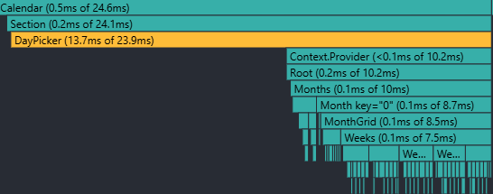

# React 최적화 Part 1 - 모바일 청첩장 프로젝트

## 프로젝트 환경 구성

<details>
  <summary>열기</summary>
  <div markdown="1">
  
  - Boilerplate
    - Create React App + Typescript
  - Rules
    - EsLint + Prettier
  - Style
    - SCSS
  - Package Manger
    - Yarn Berry(+ pnp)
      - 효율적인 의존성 검색
      - 엄격한 의존성 관리
      - CI 시간 단축

### npm을 쓰지 않는 이유

- node_modules가 너무 무겁고 복잡함
- 의존성 검색이 비효율적
- 설치가 비효율적
  - 각 라이브러리의 의존성 패키지 중 중복되는 것들이 버전이 다를 경우 각각 다른 버전의 똑같은 라이브러리들이 설치됨
- 유령 의존성

  </div>
</details>

## 프로젝트 설정

<details>
<summary>열기</summary>
<div markdown="1">

### 프로젝트 생성

```bash
npm install -g yarn
yarn create react-app part1_wedding --template typescript
```

### Yarn Berry (PnP) 설정

1. 버전 설정

   ```bash
   yarn set version berry
   ```

2. Node linker 설정

   - `.yarnrc.yml` 파일 수정

   ```yaml
   yarnPath: .yarn/releases/yarn-3.6.1.cjs
   # 새로 추가해야 하는 부분
   nodeLinker: pnp
   ```

3. pnp 환경으로 설정

   ```bash
   yarn install
   ```

4. Yarn Berry, IDE 통합
   - vscode extension ZipFS - a zip file system 설치
5. 타입스크립트를 사용할 수 있도록 연결 설정

   ```bash
   yarn dlx @yarnpkg/sdks vscode
   ```

   - vscode에서 Ctrl + P 눌러서 > Typescript: Select Typescript Version… 선택
   - workspace version 선택
     - 만약 workspace 버전이 보이지 않을 시, 의존성 패키지들이 잘 설치되었는지 다시 확인
     - .vscode 폴더의 위치가 올바르게 설정되어있는지 확인
     - 그래도 안 나오면 터미널에 `code .` 입력해서 vscode reload(⇒ 이 방법이 답이었음)

6. .gitignore 설정

   ```bash
   .yarn/*
   !.yarn/cache
   !.yarn/releases
   !.yarn/patches
   !.yarn/plugins
   !.yarn/sdks
   !.yarn/versions
   ```

7. App.test.tsx에 발생하는 에러 제거(지금은 안 남)

   ```bash
   yarn remove @testing-library/jest-dom
   yarn add -D @types/testing-library__jest-dom @testing-library/jest-dom
   ```

### ESLint 설정(버전 업그레이드 안된 강의임)

1. 라이브러리 설치

   ```bash
   yarn add -D eslint prettier eslint-plugin-prettier eslint-config-prettier eslint-plugin-react eslint-config-react-app
   ```

2. Config 설정 분리
   - 루트 폴더에 `.eslintrc.json` 파일 생성하여 `package.json`에 있던 `eslintconfig` 내용 분리하기
     - `package.json`에서는 삭제
     ```json
     {
       "extends": [
         "react-app",
         "react-app/jest",
         "plugin:prettier/recommended"
       ],
       "plugins": ["prettier"],
       "rules": {
         "prettier/prettier": "error"
       }
     }
     ```
   - `.prettierrc` 파일 생성
     ```json
     {
       "useTabs": false,
       "printWidth": 80,
       "tabWidth": 2,
       "singleQuote": true,
       "trailingComma": "all",
       "endOfLine": "lf",
       "semi": false,
       "arrowParens": "always"
     }
     ```
3. 연결 설정

   - Ctrl + ‘p’ > Open Settings(JSON) > settings.json

   ```json
   {
     "editor.codeActionsOnSave": {
       "source.fixAll.eslint": true
     },
     "files.eol": "\n",
     "window.zoomLevel": 3,
     "liveServer.settings.donotShowInfoMsg": true
   }
   ```

### ESLint 설정(셀프 버전 업그레이드, 강의X)

1. 라이브러리 설치

   ```bash
   yarn add -D eslint prettier @eslint/js eslint-config-prettier eslint-plugin-prettier eslint-plugin-react eslint-plugin-react-hooks globals @typescript-eslint/eslint-plugin @typescript-eslint/parser
   ```

2. config 설정

   ```jsx
   // eslint.config.mjs

   // eslint.config.mjs (ES Module 형식)
   import eslint from '@eslint/js';
   import eslintPluginReact from 'eslint-plugin-react';
   import eslintPluginReactHooks from 'eslint-plugin-react-hooks';
   import eslintPluginPrettier from 'eslint-plugin-prettier';
   import eslintConfigPrettier from 'eslint-config-prettier';
   import typescriptEslintPlugin from '@typescript-eslint/eslint-plugin';
   import typescriptEslintParser from '@typescript-eslint/parser';
   import globals from 'globals';

   export default [
     { ignores: ['dist'] },
     {
       files: ['**/*.{js,jsx,ts,tsx}'],
       plugins: {
         '@typescript-eslint': typescriptEslintPlugin,
         react: eslintPluginReact,
         'react-hooks': eslintPluginReactHooks,
         prettier: eslintPluginPrettier,
       },
       languageOptions: {
         parser: typescriptEslintParser,
         ecmaVersion: 2020, // 또는 최신 ECMAScript 버전
         sourceType: 'module',
         globals: {
           ...globals.browser,
           ...globals.node,
           ...globals.es5,
           ...globals.jest,
         },
       },
       linterOptions: {
         reportUnusedDisableDirectives: true,
       },
       rules: {
         ...eslint.configs.recommended.rules,
         ...eslintPluginReact.configs.recommended.rules,
         ...eslintPluginReactHooks.configs.recommended.rules,
         ...eslintConfigPrettier.rules,
         'prettier/prettier': [
           'error',
           {
             endOfLine: 'auto',
           },
         ],
       },
       settings: {
         react: {
           version: 'detect',
         },
       },
     },
   ];
   ```

   ```jsx
   // .prettierrc
   {
     "useTabs": false,
     "printWidth": 80,
     "tabWidth": 2,
     "singleQuote": true,
     "trailingComma": "all",
     "endOfLine": "lf",
     "semi": true,
     "arrowParens": "always"
   }
   ```

3. tsconfig.json에 에러 생기면 추가 설정

   ```json
   {
     "compilerOptions": {
       "target": "es5",
       "lib": ["dom", "dom.iterable", "esnext"],
       **"types": ["@testing-library/jest-dom"],**
       "allowJs": true,
       "skipLibCheck": true,
       "esModuleInterop": true,
       "allowSyntheticDefaultImports": true,
       "strict": true,
       "forceConsistentCasingInFileNames": true,
       "noFallthroughCasesInSwitch": true,
       "module": "esnext",
       "moduleResolution": "node",
       "resolveJsonModule": true,
       "isolatedModules": true,
       "noEmit": true,
       "jsx": "react-jsx"
     },
     "include": ["src"]
   }
   ```

### Craco 설정

`Craco(Create-React-App Configuartion Override)`

- CRA에 config를 설정을 덮어쓰기 위한 패키지
- [참고](https://craco.js.org/)

1. craco 설치

   ```bash
   yarn add -D @craco/craco craco-alias
   ```

2. `tsconfig.paths.json` 파일 생성

   ```json
   {
     "compilerOptions": {
       "baseUrl": ".",
       "paths": {
         "@/*": ["src/*"],
         "@components/*": ["src/components/*"]
       }
     }
   }
   ```

3. `craco.config.cjs` 파일 설정

   ```jsx
   const cracoAlias = require('craco-alias');

   module.exports = {
     plugins: [
       {
         plugin: cracoAlias,
         options: {
           source: 'tsconfig',
           tsConfigPath: 'tsconfig.paths.json',
         },
       },
     ],
   };
   ```

4. `tsconfig.js` 파일 수정

   ```jsx
   {
     "extends": "./tsconfig.paths.json",
     "compilerOptions": {
       "target": "es5",
       "lib": ["dom", "dom.iterable", "esnext"],
       "types": ["@testing-library/jest-dom"],
       "allowJs": true,
       "skipLibCheck": true,
       "esModuleInterop": true,
       "allowSyntheticDefaultImports": true,
       "strict": true,
       "forceConsistentCasingInFileNames": true,
       "noFallthroughCasesInSwitch": true,
       "module": "esnext",
       "moduleResolution": "node",
       "resolveJsonModule": true,
       "isolatedModules": true,
       "noEmit": true,
       "jsx": "react-jsx"
     },
     "include": ["src", "tsconfig.paths.json"]
   }

   ```

5. `package.json` 수정

   ```json
   {
     ...
     "scripts": {
       "start": "craco start",
       "build": "craco build",
       "eject": "craco eject",
       "lint": "eslint src/**/*.{js,jsx,ts,tsx,json}",
       "lint:fix": "eslint --fix 'src/**/*.{js,jsx,ts,tsx,json}'",
       "dev:db": "json-server --watch db.json --port=8888"
     },
     ...
   }

   ```

6. 추가적으로 eslint에서 오류 나서 임의로 eslint 8.57.0 버전으로 다운그레이드 함

### SCSS 설정

`SCSS`

- CSS 기능을 확장시켜주는 도구
- CSS의 모든 기능을 포함
- 변수, 믹스인, 상속과 같은 추가적인 기능들을 제공
- 재사용성을 높이고 유지보수 용이하게 함

1. 패키지 설치

   ```bash
   yarn add classnames sass
   ```

2. 폴더 설정

   - `src/scss/global.scss` 생성하여 스타일 지정할 파일 생성

   ```scss
   @charset "utf-8"
   
   :root {
     --red: #ea7664;
     --black: #544f4f;
     --brown: #89757a;
     --beige: #f6f5f5;
   }
   ```

3. import 하여 사용

   ```jsx
   // 사용 예시(App.tsx)

   import React from 'react';
   import logo from './logo.svg';
   import './App.css';
   **import classNames from 'classnames/bind';

   import styles from './App.module.scss';

   const cx = classNames.bind(styles);**

   function App() {
     return (
       <div className={**cx('container')**}>
         <header className="App-header">
           
           <p>
             Edit <code>src/App.tsx</code> and save to reload.
           </p>
           <a
             className="App-link"
             href="https://reactjs.org"
             target="_blank"
             rel="noopener noreferrer"
           >
             Learn React
           </a>
         </header>
       </div>
     );
   }

   export default App;

   ```

   ```jsx
   // 사용 예시(App.module.scss)

   .container {
     background-color: var(--red);
   }
   ```

   </div>
   </details>

## JSON Server 활용하여 REST API 구현

<details>
<summary>열기</summary>
<div markdown="1">

### REST란

- 웹의 기본 프로토콜인 HTTP를 기반으로 구현되며, HTTP 메서드와 URL을 이용하여 자원과 하고자하는 행동을 표현

### REST API란

- REST한 방식으로 설계된 API
- 가장 널리 사용되는 아키텍처 스타일 중 하나
- 서버의 HTTP 메서드를 사용하여 CRUD(Create, Read, Update, Delete) 연산 수행
- 리소스는 URL로 식별
- URL은 어떤 자원에 접근할 것인지, 메소드는 어떤 행동을 할 지에 대한 규칙을 가지고 있기 때문에 리소스와 하고자 하는 행동을 한눈에 파악하기 쉬움

### JSON Server

- JSON 파일을 이용하여 REST API 서버를 빠르고 간단하게 생성하기 위한 도구
- JSON 파일을 데이터베이스처럼 도앚ㄱ하게 할 수 있음
- HTTP 메서드를 활용하여 데이터에 접근하고 수정할 수 있는 API를 만들 수 있음
- [참고](https://github.com/typicode/json-server)

### JSON Server 설정

1. json-server 라이브러리 설치

   ```bash
   yarn add -D json-server
   ```

2. `db.json` 파일 생성

   ```json
   {
     "posts": [{ "id": 1, "title": "json-server", "author": "typicode" }],
     "comments": [{ "id": 1, "body": "some comment", "postId": 1 }],
     "profile": { "name": "typicode" }
   }
   ```

3. `package.json`에 json-server 명령어 설정

   ```json
   {
     "name": "part1_wedding",
     "version": "0.1.0",
     "private": true,
     "type": "module",
     "dependencies": {
       "@testing-library/dom": "^10.4.0",
       "@testing-library/react": "^16.1.0",
       "@testing-library/user-event": "^13.2.1",
       "@types/jest": "^27.0.1",
       "@types/node": "^16.7.13",
       "@types/react": "^19.0.0",
       "@types/react-dom": "^19.0.0",
       "classnames": "^2.5.1",
       "react": "^19.1.0",
       "react-dom": "^19.1.0",
       "react-scripts": "5.0.1",
       "sass": "^1.86.3",
       "typescript": "^4.4.2",
       "web-vitals": "^2.1.0"
     },
     "scripts": {
       "start": "craco start",
       "build": "craco build",
       "test": "craco test",
       "eject": "craco eject",
       "lint": "eslint src/**/*.{js,jsx,ts,tsx,json}",
       "lint:fix": "eslint --fix 'src/**/*.{js,jsx,ts,tsx,json}'",
       "dev:db": "json-server --watch db.json --port=8888"
     },
     "eslintConfig": {
       "extends": ["react-app", "react-app/jest"]
     },
     "browserslist": {
       "production": [">0.2%", "not dead", "not op_mini all"],
       "development": [
         "last 1 chrome version",
         "last 1 firefox version",
         "last 1 safari version"
       ]
     },
     "packageManager": "yarn@4.8.1",
     "devDependencies": {
       "@craco/craco": "^7.1.0",
       "@eslint/js": "^9.23.0",
       "@testing-library/jest-dom": "^6.6.3",
       "@types/testing-library__jest-dom": "^6.0.0",
       "@typescript-eslint/eslint-plugin": "^8.29.0",
       "@typescript-eslint/parser": "^8.29.0",
       "craco-alias": "^3.0.1",
       "eslint": "8.57.0",
       "eslint-config-prettier": "^10.1.1",
       "eslint-plugin-prettier": "^5.2.6",
       "eslint-plugin-react": "^7.37.5",
       "eslint-plugin-react-hooks": "^5.2.0",
       "globals": "^16.0.0",
       "json-server": "^1.0.0-beta.3",
       "prettier": "^3.5.3"
     }
   }
   ```

### 데이터 가져오기

```jsx
import React, { useEffect, useState } from 'react';
import classNames from 'classnames/bind';

import styles from './App.module.scss';
import FullScreenMessage from './components/shared/FullScreenMessage';

const cx = classNames.bind(styles);

function App() {
  const [wedding, setWedding] = useState(null);
  const [loading, setLoading] = useState(false);
  const [error, setError] = useState(false);
  // 1. 데이터 호출
  useEffect(() => {
    setLoading(true);

    fetch('http://localhost:8888/wedding')
      .then((res) => {
        if (res.ok === false) {
          throw new Error('청첩장 정보를 불러오지 못했습니다.');
        }
        return res.json();
      })
      .then((data) => {
        setWedding(data);
      })
      .catch((e) => {
        console.log(e);
        setError(true);
      })
      .finally(() => {
        setLoading(false);
      });
  }, []);

  if (loading) return <FullScreenMessage type="loading" />;

  if (error) return <FullScreenMessage type="error" />;

  return <div className={cx('container')}>{JSON.stringify(wedding)}</div>;
}

export default App;
```

</div>
</details>

## 인트로 동영상 구현

<details>
<summary>열기</summary>
<div markdown="1">

### 웹에서 많이 사용되는 비디오 포맷

- MP4 (MPEG-4 Part 14):
  - 최신 웹 브라우저 대부분과 호환되는 인터넷 친화적인 비디오 포맷
  - 품질이 좋고, 파일 크기가 작아, 웹에서 동영상을 재생하는데 인기 있는 선택지
- WebM
  - HTML5 비디오 및 오디오 태그와 함께 사용하기 위해 Google이 개발한 비디오 포맷
  - 고화질 동영상을 손실 없이 효과적으로 압축할 수 있는 고성능 비디오 코덱인 VP8 및 VP9를 지원

```jsx
import React from 'react';
import classNames from 'classnames/bind';
import styles from './Video.module.scss';

import Section from '@shared/Section';

const cx = classNames.bind(styles);

function Video() {
  return (
    <Section className={cx('container')}>
      <video
        autoPlay={true}
        muted={true}
        loop={true}
        poster="/assets/poster.jpg"
      >
        <source src="/assets/main.mp4" />
      </video>
    </Section>
  );
}

export default Video;
```

</div>
</details>

## 이미지 갤러리 구현

<details>
<summary>열기</summary>
<div markdown="1">

### display: grid 사용하여 비율 맞춰 배치하는 방법

```scss
//ImageGallery.module.scss
.wrap-images {
  display: grid;
  grid-template-columns: repeat(3, 1fr);
  gap: 6px;

  .wrap-image {
    width: 100%;
    position: relative;

    &::after {
      display: block;
      content: '';
      padding-bottom: 100%;
    }

    img {
      width: 100%;
      height: 100%;
      position: absolute;
      left: 0;
      object-fit: cover;
      border-radius: 8px;
    }
  }
}
```

```jsx
//ImageGallery.tsx
import React from 'react';
import classNames from 'classnames/bind';
import styles from './ImageGallery.module.scss';
import Section from '@shared/Section';

const cx = classNames.bind(styles);

function ImageGallery({ images }: { images: string[] }) {
  return (
    <Section title="사진첩">
      <ul className={cx('wrap-images')}>
        {images.map((src, idx) => (
          <li key={idx} className={cx('wrap-image')}>
            
          </li>
        ))}
      </ul>
    </Section>
  );
}

export default ImageGallery;

```

### Swiper 라이브러리 사용

- 닫기 버튼을 누르면 ImageGallery에서 selectedIdx를 -1로 초기화하는 setState 함수를 받아 닫도록 구현

  ```scss
  import React from 'react';
  import { Swiper, SwiperSlide } from 'swiper/react';
  import 'swiper/css';
  import classNames from 'classnames/bind';
  import styles from './ImageViewer.module.scss';
  import './swiper.css';

  const cx = classNames.bind(styles);

  function ImageViewer({
    images,
    open = false,
    selectedIdx,
    onClose,
  }: {
    images: string[];
    open: boolean;
    selectedIdx: number;
    onClose: () => void;
  }) {
    if (open === false) {
      return null;
    }

    return (
      <div className={cx('dimmed')}>
        <CloseButton className={cx('icon-close')} onClose={onClose} />
        <Swiper
          spaceBetween={20}
          slidesPerView={1}
          loop={true}
          initialSlide={selectedIdx}
        >
          {images.map((src, idx) => (
            <SwiperSlide key={idx}>
              
            </SwiperSlide>
          ))}
        </Swiper>
      </div>
    );
  }

  function CloseButton({
    onClose,
    className,
  }: {
    onClose: () => void;
    className: string;
  }) {
    return (
      <svg
        className={className}
        id="Icons"
        viewBox="0 0 24 24"
        xmlns="http://www.w3.org/2000/svg"
        onClick={onClose}
      >
        <defs></defs>
        <path d="M12,0A12,12,0,1,0,24,12,12.013,12.013,0,0,0,12,0Zm0,22A10,10,0,1,1,22,12,10.011,10.011,0,0,1,12,22Z" />
        <path d="M16.707,7.293a1,1,0,0,0-1.414,0L12,10.586,8.707,7.293A1,1,0,1,0,7.293,8.707L10.586,12,7.293,15.293a1,1,0,1,0,1.414,1.414L12,13.414l3.293,3.293a1,1,0,0,0,1.414-1.414L13.414,12l3.293-3.293A1,1,0,0,0,16.707,7.293Z" />
      </svg>
    );
  }

  export default ImageViewer;
  ```

- 기본 Swiper css를 커스텀하기 위해 swiper.css 생성 & import

  ```scss
  .swiper,
  .swiper-wrapper {
    height: 100% !important;
  }

  .swiper-slide {
    display: flex;
    justify-content: center;
    align-items: center;
    height: 100%;
  }

  .swiper-slide img {
    width: 100%;
  }
  ```

  </div>
  </details>

## 본문 구현(SCSS mixin 활용)

<details>
<summary>열기</summary>
<div markdown="1">

- scss 폴더에 utils.scss 파일 생성하여 mixin 선언
  ```scss
  @mixin txt-content {
    text-align: center;
    line-height: 26px;
  }
  ```
- 중복된 스타일을 가지던 scss파일에 mixin import하여 사용

  ```scss
  @import '@scss/utils.scss';

  .container {
    @include txt-content;

    .wrap-people {
      font-size: 22px;
      display: flex;
      justify-content: center;
      align-items: center;
      letter-spacing: 1.4px;
      font-weight: bold;
      margin: 42px 0 8px;

      .ico-heart {
        fill: var(--red);
        width: 16px;
        height: 16px;
        margin: 0 6px;
      }
    }

    .wrap-location {
      display: flex;
      flex-direction: column;
      margin-bottom: 40px;
    }

    .ico-flower {
      width: 24px;
      height: 24px;
      margin-bottom: 6px;
    }
  }
  ```

  ```scss
  @import '@scss/utils.scss';

  .container {
    @include txt-content;

    .ico-post {
      width: 20px;
      height: 20px;
      margin-bottom: 72px 0 8px;
    }
  }
  ```

  </div>
  </details>

## react-day-picker 사용해서 캘린더 구현

<details>
<summary>열기</summary>
<div markdown="1">

### 강의 버전(v^8.8.0)

- css 커스텀을 위해 css 따로 선언해서 style 태그 안에 넣어주면 custom 가능
- default month를 주기 위해 month 사용
- selected 사용하여 선택된 날짜 표시

```jsx
import React from 'react';
import classNames from 'classnames/bind';
import Section from '@shared/Section';
import styles from './Calendar.module.scss';
import { parseISO, format } from 'date-fns';
import { ko } from 'date-fns/locale';
import 'react-day-picker/dist/style.css';
import { DayPicker } from 'react-day-picker';

const cx = classNames.bind(styles);

const css = `
  .rdp-caption {
    display: none;
  }

  .rdp-cell {
    cursor: default
  }

  .rdp-head_cell {
    font-weight: bold;
    font-size: 14px;
  }

  .rdp-day_selected {
    background-color: var(--red);
    font-weight: bold;
    color: #fff;
  }

  .rdp-day_selected:hover {
    background-color: var(--red);
  }
`;

function Calendar({ date }: { date: string }) {
  const weddingDate = parseISO(date);

  return (
    <Section
      title={
        <div className={cx('wrap-header')}>
          <span className={cx('txt-date')}>
            {format(weddingDate, 'yyyy.MM.dd')}
          </span>
          <span className={cx('txt-time')}>
            {format(weddingDate, 'aaa h시 eeee', { locale: ko })}
          </span>
        </div>
      }
    >
      <div className={cx('wrap-calender')}>
        <style>{css}</style>
        <DayPicker
          locale={ko}
          selected={weddingDate}
          month={weddingDate}
          formatters={{ formatCaption: () => '' }}
        />
      </div>
    </Section>
  );
}

export default Calendar;

```

### 최신 버전(v^9.6.5)

- mode 선택하지 않으면 selected 사용할 수 없음

```jsx
import React from 'react';
import classNames from 'classnames/bind';
import Section from '@shared/Section';
import styles from './Calendar.module.scss';
import { parseISO, format } from 'date-fns';
import { ko } from 'date-fns/locale';
import { DayPicker } from 'react-day-picker';
import 'react-day-picker/style.css';

const cx = classNames.bind(styles);

const css = `
  .rdp-nav {
    display: none;
  }

  .rdp-month_caption {
    display: none;
  }

  .rdp-weekday {
    font-weight: bold;
    font-size: 14px;
  }

  .rdp-selected {
    .rdp-day_button {
      background-color: var(--red);
      font-weight: bold;
      color: #fff;
      border: none;
    }
  }

  .rdp-day_button {
    cursor: default;
  }
`;

function Calendar({ date }: { date: string }) {
  const weddingDate = parseISO(date);

  return (
    <Section
      title={
        <div className={cx('wrap-header')}>
          <span className={cx('txt-date')}>
            {format(weddingDate, 'yyyy.MM.dd')}
          </span>
          <span className={cx('txt-time')}>
            {format(weddingDate, 'aaa h시 eeee', { locale: ko })}
          </span>
        </div>
      }
    >
      <div className={cx('wrap-calender')}>
        <style>{css}</style>
        <DayPicker
          locale={ko}
          month={weddingDate}
          selected={weddingDate}
          mode="single"
          formatters={{ formatCaption: () => '' }}
          onSelect={() => {}}
        />
      </div>
    </Section>
  );
}

export default Calendar;

```

</div>
</details>

## Kakao Map API 사용

<details>
<summary>열기</summary>
<div markdown="1">

### api key 발급

- https://developers.kakao.com/에서 애플리케이션 만들어서 앱 키 - JavaScript 키 사용

### 사이트 도메인 등록

- 플랫폼 - Web에서 사이트 도메인 주소 등록
  - 따로 배포하지 않았다면 localhost:[포트번호] 등록하면 됨

### 💢403에러가 계속 난다면 확인할 것

- 강의에는 나오지 않지만 kakao developers - 프로젝트 앱 - 제품 설정 - 카카오 맵에서 활성화 해야 카카오 맵 api 사용 가능!

### 환경 변수 설정

- 외부에 노출되면 안되는 자원들을 관리하기 위해 .env 파일에 선언하고 불러와서 사용
- git에 올리면 안되는 파일!!

### 카카오 지도 load

- script 태그를 바로 넣는게 아니라, 비동기적으로 sdk를 통해 지도를 받아온 후, script 태그를 appendChild 해주는 방식

```tsx
import React, { useEffect, useRef } from 'react';
import classNames from 'classnames/bind';
import Section from '@shared/Section';
import styles from './Map.module.scss';
import { Location } from '@models/wedding';

declare global {
  interface Window {
    kakao: any;
  }
}

const cx = classNames.bind(styles);

function Map({ location }: { location: Location }) {
  const mapContainer = useRef(null);

  useEffect(() => {
    const script = document.createElement('script');
    script.src = `https://dapi.kakao.com/v2/maps/sdk.js?appkey=${process.env.REACT_APP_KAKAO_APP_KEY}&autoload=false`;
    script.async = true;

    document.head.appendChild(script);

    script.onload = () => {
      window.kakao.maps.load(() => {
        const position = new window.kakao.maps.LatLng(
          location.lat,
          location.lng,
        );

        const options = {
          center: position,
          level: 3,
        };

        const marker = new window.kakao.maps.Marker({
          position,
        });
        const map = new window.kakao.maps.Map(mapContainer.current, options);
        marker.setMap(map);
      });
    };
  }, [location]);

  return (
    <Section
      title={
        <div className={cx('wrap-header')}>
          <span className={cx('txt-title')}>오시는길</span>
          <span className={cx('txt-subtitle')}>{location.name}</span>
          <span className={cx('txt-subtitle')}>{location.address}</span>
        </div>
      }
    >
      <div className={cx('wrap-map')}>
        <div className={cx('map')} ref={mapContainer}></div>
        <a
          className={cx('btn-find-way')}
          href={location.link}
          target="_blank"
          rel="noreferrer"
        >
          길찾기
        </a>
      </div>

      <div>
        <WayToCome label="버스" list={location.waytocome.bus} />
        <WayToCome label="지하철" list={location.waytocome.metro} />
      </div>
    </Section>
  );
}

function WayToCome({
  label,
  list,
}: {
  label: React.ReactNode;
  list: string[];
}) {
  return (
    <div className={cx('wrap-waytocome')}>
      <div className={cx('txt-label')}>{label}</div>
      <ul>
        {list.map((waytocome, idx) => (
          <li key={idx}>{waytocome}</li>
        ))}
      </ul>
    </div>
  );
}

export default Map;
```

</div>
</details>

## 연락처 구현

<details>
<summary>열기</summary>
<div markdown="1">

### Accordion 컴포넌트 구현

- 토글 상태에 따라 className을 부여해 두 가지 상태의 컴포넌트 css를 다르게 설정

```tsx
import React, { PropsWithChildren, useState } from 'react';
import classNames from 'classnames/bind';
import styles from './Accordion.module.scss';

const cx = classNames.bind(styles);

interface AccordionProps {
  label: string;
}

function Accordion({ label, children }: PropsWithChildren<AccordionProps>) {
  const [expanded, setExpanded] = useState(false);

  const handleToggle = () => {
    setExpanded((prev) => !prev);
  };

  return (
    <div className={cx(['wrap-accordion'], expanded ? 'open' : '')}>
      <div className={cx('wrap-header')} onClick={handleToggle}>
        <span>{label}</span>
        <IconArrowDown className={cx('ico-arrow-down')} />
      </div>
      <div className={cx('wrap-content')}>{children}</div>
    </div>
  );
}

function IconArrowDown({ className }: { className: string }) {
  return (
    <svg className={className} version="1.1" viewBox="0 0 512 512">
      <polygon points="396.6,160 416,180.7 256,352 96,180.7 115.3,160 256,310.5 " />
    </svg>
  );
}

export default Accordion;
```

```scss
.wrap-accordion {
  margin-bottom: 6px;

  .wrap-header {
    display: flex;
    justify-content: space-between;
    align-items: center;
    cursor: pointer;
    background-color: var(--beige);
    border-radius: 6px;
    padding: 10px;

    .ico-arrow-down {
      width: 20px;
      height: 20px;
    }
  }

  .wrap-content {
    display: none;
  }
}

.wrap-accordion.open {
  .wrap-header {
    .ico-arrow-down {
      transform: rotate(-180deg);
    }
  }

  .wrap-content {
    display: block;
  }
}
```

### 계좌번호 클립보드 복사 기능 구현

- `react-copy-to-clipboard` 라이브러리 사용

```tsx
function ContactInfo({ name, account, phoneNumber }: Person) {
  return (
    <div className={cx('wrap-contact')}>
      <div className={cx('wrap-contact-info')}>
        <span>{`${account.bankName} | ${account.accountNumber}`}</span>
        <span>{name}</span>
      </div>
      <ul className={cx('wrap-buttons')}>
        <li>
          <a className={cx('button')} href={`tel: ${phoneNumber}`}>
            전화
          </a>
        </li>
        <li>
          <CopyToClipboard
            text={`${account.bankName} ${account.accountNumber}`}
            onCopy={() => {
              alert('복사가 완료되었습니다.');
            }}
          >
            <button className={cx('button')}>복사</button>
          </CopyToClipboard>
        </li>
        {account.kakaopayLink != null ? (
          <li>
            <a
              className={cx('button')}
              href={account.kakaopayLink}
              target="_blank"
              rel="noreferrer"
            >
              송금
            </a>
          </li>
        ) : null}
      </ul>
    </div>
  );
}
```

</div>
</details>

## 카카오톡 및 링크 공유하기 기능 구현

<details>
<summary>열기</summary>
<div markdown="1">

### 카카오톡 공유하기

- kakao developers - 도구 - 카카오톡 공유하기 문서 [참고](https://developers.kakao.com/tool/demo/message/kakaolink)
- 카카오 맵 api 와 똑같은 방식으로 사용

```tsx
useEffect(() => {
  const script = document.createElement('script');
  script.src = 'https://t1.kakaocdn.net/kakao_js_sdk/2.7.4/kakao.min.js';
  script.async = true;

  document.head.appendChild(script);

  script.onload = () => {
    if (!window.Kakao.isInitialized()) {
      window.Kakao.init(process.env.REACT_APP_KAKAO_APP_KEY);
    }
  };
}, []);

const handleShareKakao = () => {
  window.Kakao.Share.sendDefault({
    objectType: 'feed',
    content: {
      title: `${groomName}💗${brideName} 결혼합니다.`,
      description: `${format(parseISO(date), 'M월 d일 eeee aaa h시', { locale: ko })}`,
      imageUrl:
        'https://img.freepik.com/premium-vector/cute-asian-groom-and-bride-characters-flat-design-style-vector-illustration_540284-382.jpg',
      link: {
        mobileWebUrl: window.location.origin,
        webUrl: window.location.origin,
      },
    },
    buttons: [
      {
        title: '청첩장 보기',
        link: {
          mobileWebUrl: window.location.origin,
          webUrl: window.location.origin,
        },
      },
    ],
  });
};

return (
  <Section title="공유하기">
    <div>
      <button onClick={handleShareKakao}>카카오톡</button>
      <button>링크</button>
    </div>
  </Section>
);
```

### 링크 공유하기

- CopyToClipboard 사용하여 계좌번호 복사와 동일하게 구현
</div>
</details>

## Portal을 이용한 모달 구현

<details>
<summary>열기</summary>
<div markdown="1">

### 편리한 z-index 관리를 위한 variable.scss 설정

```scss
// variable.scss

$dimmed-zindex: 1000;
$modal-zindex: 1001;
```

```scss
// Dimmed.module.scss에서 variable을 import해서 사용 가능

@import '@scss/variable.scss';

.dimmed {
  position: fixed;
  top: 0;
  right: 0;
  bottom: 0;
  left: 0;
  background-color: rgba(0, 0, 0, 0.5);
  z-index: $dimmed-zindex;
}
```

### createPortal 사용

- public - `index.html`에 모달을 생성할 div를 만들어준다
  ```html
  <body>
    <noscript>You need to enable JavaScript to run this app.</noscript>
    <div id="root"></div>
    <div id="root-portal"></div>
  </body>
  ```
- Modal 컴포넌트 구현

  ```tsx
  import classNames from 'classnames/bind';
  import React from 'react';
  import Dimmed from './Dimmed';
  import styles from './Modal.module.scss';

  const cx = classNames.bind(styles);

  interface ModalProps {
    open: boolean;
    title?: string;
    body: React.ReactNode;
    rightBtnLabel?: string;
    onRightBtnClick: () => void;
    leftBtnLabel?: string;
    onLeftBtnClick: () => void;
  }

  function Modal({
    open,
    title,
    body,
    rightBtnLabel = '확인',
    leftBtnLabel = '닫기',
    onRightBtnClick,
    onLeftBtnClick,
  }: ModalProps) {
    if (open === false) {
      return null;
    }

    return (
      <Dimmed>
        <div className={cx('wrap-modal')}>
          <div className={cx('wrap-body')}>
            <div className={cx('wrap-content')}>
              {title === null ? null : (
                <div className={cx('txt-title')}>{title}</div>
              )}
              {body}
            </div>
            <div className={cx('wrap-buttons')}>
              <button onClick={onLeftBtnClick}>{leftBtnLabel}</button>
              <button onClick={onRightBtnClick}>{rightBtnLabel}</button>
            </div>
          </div>
        </div>
      </Dimmed>
    );
  }

  export default Modal;
  ```

- Modal Context 구현

  ```tsx
  import Modal from '@shared/Modal';
  import React, {
    ComponentProps,
    createContext,
    useContext,
    useState,
  } from 'react';
  import { createPortal } from 'react-dom';

  type ModalProps = ComponentProps<typeof Modal>;
  type ModalOptions = Omit<ModalProps, 'open'>;

  interface ModalContextValue {
    open: (options: ModalOptions) => void;
    close: () => void;
  }

  const Context = createContext<ModalContextValue | undefined>(undefined);

  const defaultValues: ModalProps = {
    open: false,
    body: null,
    onRightBtnClick: () => {},
    onLeftBtnClick: () => {},
  };

  export function ModalContext({ children }: { children: React.ReactNode }) {
    const [modalState, setModalState] = useState<ModalProps>(defaultValues);

    const $portal_root = document.getElementById('root-portal');

    const open = (options: ModalOptions) => {
      setModalState({ ...options, open: true });
    };

    const close = () => {
      setModalState(defaultValues);
    };

    const values = {
      open,
      close,
    };

    return (
      <Context.Provider value={values}>
        {children}
        {$portal_root != null
          ? createPortal(<Modal {...modalState} />, $portal_root)
          : null}
      </Context.Provider>
    );
  }

  export function useModalContext() {
    const values = useContext(Context);

    if (values == null) {
      throw new Error('ModalContext 안에서 사용해주세요');
    }

    return values;
  }
  ```

- 참석 인원 모달 컴포넌트 구현 및 api 연결

  ```tsx
  import React, { useEffect, useRef } from 'react';
  import { useModalContext } from '@contexts/ModalContext';
  import { Wedding } from '@models/wedding';

  function AttendCountModal({ wedding }: { wedding: Wedding }) {
    const { open, close } = useModalContext();

    const $input = useRef<HTMLInputElement>(null);

    const haveSeenModal = localStorage.getItem('@have-seen-modal');

    useEffect(() => {
      if (haveSeenModal === 'true') {
        return;
      }

      open({
        title: `현재 참석자: ${wedding.attendCount} 명`,
        body: (
          <div>
            <input
              placeholder="참석 가능 인원을 추가해주세요"
              style={{ width: '100%', boxSizing: 'border-box' }}
              ref={$input}
              type="number"
            />
          </div>
        ),
        onLeftBtnClick: () => {
          localStorage.setItem('@have-seen-modal', 'true');
          close();
        },
        onRightBtnClick: async () => {
          if ($input.current == null) {
            return;
          }

          await fetch('http://localhost:8888/wedding', {
            method: 'PUT',
            body: JSON.stringify({
              ...wedding,
              attendCount: wedding.attendCount + Number($input.current.value),
            }),
            headers: {
              'Content-Type': 'application/json',
            },
          });

          localStorage.setItem('@have-seen-modal', 'true');
          close();
        },
      });
    }, []);

    return null;
  }

  export default AttendCountModal;
  ```

  </div>
  </details>

## 💡프로젝트 최적화

<details>
<summary>열기</summary>
<div markdown="1">

### LightHouse

- Google에서 개발한 웹 페이지 품질 평가 자동화 도구
- 웹 페이지의 문제점을 찾고, 개선 방안을 제안

### 동영상 최적화

- 동영상 최적화에 있어서 제일 중요한 것은 **용량을 줄이는 것**!!!
  1. 동영상 압축
  - 무조건적으로 압축하기보다는 화질을 보고 충분한 정도로만 압축
  - 너무 압축하면 프레임이 깨짐
  1. 동영상 길이 줄이기
  2. 동영상 포맷 변환
  - webm 형식으로 변환하면 화질이나 용량 적인 부분에서 유리하지만 아직 지원하지 않는 브라우저들이 있기 때문에 유의해야 함
  - source를 webm, mp4 모두 넣으면 webm을 지원하지 않는 브라우저에서는 mp4로 재생
  ```tsx
  function Video() {
    return (
      <Section className={cx('container')}>
        <video
          autoPlay={true}
          muted={true}
          loop={true}
          poster="/assets/poster.jpg"
        >
          <source src="/assets/main.webm" type="video/webm" />
          <source src="/assets/main.mp4" type="video/mp4" />
        </video>
      </Section>
    );
  }
  ```
  1. CDN 서비스 이용

### 이미지 최적화

1. 이미지 압축([Squoosh](https://squoosh.app/)) 서비스 사용하여 압축
   - webp 포맷을 변환하면 품질 대비 용량이 작아짐
2. CDN 서비스

   - [Cloudinary](https://cloudinary.com)
     - 클라우드 기반의 이미지 및 비디오 관리 서비스
   - 클라우드에 이미지를 업로드하여 url 생성
   - 생성한 url을 파일명과 format, option만 변수로 지정하여 최적화

   ```tsx
   // generateImageUrl.tsx

   function generateImageUrl({
     filename,
     format,
     option = 'q_auto,c_fill',
   }: {
     filename: string;
     format: 'jpg' | 'webp';
     option?: string;
   }) {
     return `https://res.cloudinary.com/ddyglfohj/image/upload/${option}/v1744275798/${format}/${filename}.${format}`;
   }

   export default generateImageUrl;
   ```

   ```tsx
   // ImageGallery.tsx , ImageViewer/index.tsx

   <picture>
     <source
       srcSet={generateImageUrl({
         filename: src,
         format: 'webp',
         option: 'w_240,h_240,q_auto,c_fill',
       })}
       type="image/webp"
     />
     
   </picture>
   ```

### 폰트 최적화

1. 폰트 적용 시점, font-display
   - `FOIT(flash of invisible text)`
     - 폰트를 다운로드 하기 전에는 텍스트를 노출X
   - `FOUT(flash of unstyled text)`
     - 폰트가 다운로드 되기 전에는 기본 폰트 노출
     - 다운로드 후, 폰트 교체
   - font-display 속성
     - swap(FOUT)
       - 폰트를 다운 받기 전에는 기본 폰트 노출하고, 다운로드 완료 후 폰트를 교체
     - block(FOIT)
       - 3초 내에 폰트를 다운 받지 못하면 기본 폰트 노출
     - fallback(FOIT)
       - 0.1 초 정도 block이 발생
       - 3초 이내로 다운 받지 못하면, 다운로드 여부와 상관 없이 기본 폰트 노출(캐시)
     - optional(FOIT)
       - fallback과 비슷
       - 폰트가 다운로드 받는 시간이 너무 오래 걸리면 브라우저가 연결을 취소(캐시)
2. 폰트 용량 줄이기
   - Subset
     - [필요한 글자](https://namu.wiki/w/%EC%99%84%EC%84%B1%ED%98%95/%ED%95%9C%EA%B8%80%20%EB%AA%A9%EB%A1%9D/KS%20X%201001)들만 추려서 폰트 생성
     - transfonter 서비스 사용하여 용량 줄이기 가능
3. 폰트 preload

   - FOIT와 FOUT 시간을 줄이기 위해 preload
   - 관련 package - [webpack-font-preload-plugin](https://www.npmjs.com/package/webpack-font-preload-plugin)
   - package 설치 후, `craco.config.cjs` 설정

     ```tsx
     const cracoAlias = require('craco-alias');
     const FontPreloadPlugin = require('webpack-font-preload-plugin');

     module.exports = {
       plugins: [
         {
           plugin: cracoAlias,
           options: {
             source: 'tsconfig',
             tsConfigPath: 'tsconfig.paths.json',
           },
         },
       ],
       webpack: {
         plugins: {
           add: [
             new FontPreloadPlugin({
               extensions: ['woff2'],
             }),
           ],
         },
       },
     };
     ```

### 불필요한 리렌더링 줄이기(memo)

- 효율적인 개발을 위해 [React devtools](https://chromewebstore.google.com/detail/fmkadmapgofadopljbjfkapdkoienihi?utm_source=item-share-cb) chrome 확장 프로그램 사용

#### `React.Memo`

- props가 변경되지 않는 이상 다시 렌더링을 하지 않게 함
- [참고](https://react.dev/reference/react/memo)
- React devtools의 Profiler 사용해서 분석해보면 Calendar 컴포넌트에서 부모의 state가 바뀔 때 마다 모든 요소들이 리렌더링 되고 있음
  
- Calendar에 prop으로 전해지는 date는 동적인 값이 아니라서 계속 리렌더링 될 필요 X

  ```tsx
  import { memo } from 'react';

  function Calendar({ date }: { date: string }) {
    const weddingDate = parseISO(date);

    return (
      <Section
        title={
          <div className={cx('wrap-header')}>
            <span className={cx('txt-date')}>
              {format(weddingDate, 'yyyy.MM.dd')}
            </span>
            <span className={cx('txt-time')}>
              {format(weddingDate, 'aaa h시 eeee', { locale: ko })}
            </span>
          </div>
        }
      >
        <div className={cx('wrap-calender')}>
          <style>{css}</style>
          <DayPicker
            locale={ko}
            month={weddingDate}
            selected={weddingDate}
            mode="single"
            onSelect={() => {}}
          />
        </div>
      </Section>
    );
  }

  export default memo(Calendar);
  ```

- 하지만, props가 빈번하게 바뀌는 컴포넌트는 memo를 사용하는 것이 효율적이지 않음.

#### `useCallback(function, dependencides)`

- 함수 정의를 캐시하는 React Hook
  ⇒ 리렌더링 시에 새롭게 함수를 만들지 않게 함
- dependencies 에 따라 함수를 새롭게 만들게 됨
  - 비어있으면 캐싱
- [참고](https://react.dev/reference/react/useCallback)
- open, close 함수를 useCallback 사용하여 캐싱

  <blockquote>
    <strong>📌 Tip</strong><br>
    &nbsp;ModalContext 컴포넌트가 업데이트 되면서 리렌더링 되어도 해당 함수가 항상 새로 만들어 지지 않음
  </blockquote>

  ```tsx
  // ModalContext.tsx

  import Modal from '@shared/Modal';
  import React, {
    ComponentProps,
    createContext,
    useCallback,
    useContext,
    useMemo,
    useState,
  } from 'react';
  import { createPortal } from 'react-dom';

  type ModalProps = ComponentProps<typeof Modal>;
  type ModalOptions = Omit<ModalProps, 'open'>;

  interface ModalContextValue {
    open: (options: ModalOptions) => void;
    close: () => void;
  }

  const Context = createContext<ModalContextValue | undefined>(undefined);

  const defaultValues: ModalProps = {
    open: false,
    body: null,
    onRightBtnClick: () => {},
    onLeftBtnClick: () => {},
  };

  export function ModalContext({ children }: { children: React.ReactNode }) {
    const [modalState, setModalState] = useState<ModalProps>(defaultValues);

    const $portal_root = document.getElementById('root-portal');

    const open = useCallback((options: ModalOptions) => {
      setModalState({ ...options, open: true });
    }, []);

    const close = useCallback(() => {
      setModalState(defaultValues);
    }, []);

    // open, close는 usecallback에 의해 캐싱되었으므로 ModalContext 컴포넌트가 업데이트되면서 리렌더링 되더라도 해당 함수는 항상 새로 만들어지지 않음
    const values = useMemo(
      () => ({
        open,
        close,
      }),
      [open, close],
    );

    return (
      <Context.Provider value={values}>
        {children}
        {$portal_root != null
          ? createPortal(<Modal {...modalState} />, $portal_root)
          : null}
      </Context.Provider>
    );
  }

  export function useModalContext() {
    const values = useContext(Context);

    if (values == null) {
      throw new Error('ModalContext 안에서 사용해주세요');
    }

    return values;
  }
  ```

  - AttendCountModal의 useEffect 의존성 배열에 open, close를 넣어도 캐싱된 값이기 때문에 무한 루프가 발생하지 않는다.

  ```tsx
  // AttendCountModal.tsx

  import React, { useEffect, useRef } from 'react';
  import { useModalContext } from '@contexts/ModalContext';
  import { Wedding } from '@models/wedding';

  function AttendCountModal({ wedding }: { wedding: Wedding }) {
    const { open, close } = useModalContext();

    const $input = useRef<HTMLInputElement>(null);

    const haveSeenModal = localStorage.getItem('@have-seen-modal');

    useEffect(() => {
      console.log('hi');
      if (haveSeenModal === 'true') {
        return;
      }

      open({
        title: `현재 참석자: ${wedding.attendCount} 명`,
        body: (
          <div>
            <input
              placeholder="참석 가능 인원을 추가해주세요"
              style={{ width: '100%', boxSizing: 'border-box' }}
              ref={$input}
              type="number"
            />
          </div>
        ),
        onLeftBtnClick: () => {
          localStorage.setItem('@have-seen-modal', 'true');
          close();
        },
        onRightBtnClick: async () => {
          if ($input.current == null) {
            return;
          }

          await fetch('http://localhost:8888/wedding', {
            method: 'PUT',
            body: JSON.stringify({
              ...wedding,
              attendCount: wedding.attendCount + Number($input.current.value),
            }),
            headers: {
              'Content-Type': 'application/json',
            },
          });

          localStorage.setItem('@have-seen-modal', 'true');
          close();
        },
      });
    }, [open, close, wedding, haveSeenModal]);

    return null;
  }

  export default AttendCountModal;
  ```

### 로직 추상화 - 렌더링에 집중할 수 있는 컴포넌트 환경 구성

#### `추상화`

- 내부의 로직과 복잢벙을 감추고 사용자에게 간결하고 명확한 인터페이스를 제공하는 것
- 비즈니스 로직에 대한 코드와 화면을 그리는 컴폰너트 코드가 역할에 맞게 명확하게 분리되어 있는 환경
- 역할에 분리되어 있는 컴포넌트와 비즈니스 로직 함수들은
  - 재사용성이 좋음
  - 유지보수에 용이
  - 독립적으로 테스트하기 좋음

1. 청첨장 데이터를 불러오는 부분을 커스텀 훅으로 분리

   ```tsx
   // useWedding.tsx

   import { getWedding } from '../api/wedding';
   import { Wedding } from '@models/wedding';
   import { useEffect, useState } from 'react';

   function useWedding() {
     const [wedding, setWedding] = useState<Wedding | null>(null);
     const [loading, setLoading] = useState(false);
     const [error, setError] = useState(false);
     // 1. 데이터 호출
     useEffect(() => {
       setLoading(true);

       getWedding()
         .then((res) => {
           if (res.ok === false) {
             throw new Error('청첩장 정보를 불러오지 못했습니다.');
           }
           return res.json();
         })
         .then((data) => {
           setWedding(data);
         })
         .catch((e) => {
           console.log(e);
           setError(true);
         })
         .finally(() => {
           setLoading(false);
         });
     }, []);

     return { wedding, loading, error };
   }

   export default useWedding;
   ```

   ```tsx
   export function getWedding() {
     return fetch('http://localhost:8888/wedding');
   }
   ```

2. App 컴포넌트는 화면 구성에 집중

   ```tsx
   function App() {
     const { wedding, loading, error } = useWedding();

     if (loading) return <FullScreenMessage type="loading" />;

     if (error) return <FullScreenMessage type="error" />;

     if (wedding == null) {
       return null;
     }

     const {
       date,
       galleryImages,
       groom,
       bride,
       location,
       message: { intro, invitation },
     } = wedding;

     return (
       <div className={cx('container')}>
         <Heading date={date} />
         <Video />
         <Intro
           groomName={groom.name}
           brideName={bride.name}
           locationName={location.name}
           date={date}
           message={intro}
         />
         <Invitation message={invitation} />
         <ImageGallery images={galleryImages} />
         <Calendar date={date} />
         <Map location={location} />
         <Contact groom={groom} bride={bride} />
         <Share groomName={groom.name} brideName={bride.name} date={date} />
         <AttendCountModal wedding={wedding} />
       </div>
     );
   }

   export default App;
   ```

### 로직 추상화 - 선언적 코딩

#### `선언적 코드`

- 동작이 예상 가능한 추상화 된 코드

1. Suspense를 이용하여 loading 처리

   - [참고](https://react.dev/reference/react/Suspense)
   - Suspense를 사용할 곳을 Suspense 태그로 감싸주고 fallback에 로딩 시, 띄울 컴포넌트를 넣어준다.

     ```tsx
     import React, { Suspense } from 'react';
     import ReactDOM from 'react-dom/client';
     import App from './App';
     import { ModalContext } from '@contexts/ModalContext';
     import './scss/global.scss';
     import { QueryClientProvider, QueryClient } from 'react-query';
     import FullScreenMessage from '@shared/FullScreenMessage';

     const queryClient = new QueryClient();

     const root = ReactDOM.createRoot(
       document.getElementById('root') as HTMLElement,
     );
     root.render(
       <React.StrictMode>
         <QueryClientProvider client={queryClient}>
           <ModalContext>
             <Suspense fallback={<FullScreenMessage type="loading" />}>
               <App />
             </Suspense>
           </ModalContext>
         </QueryClientProvider>
       </React.StrictMode>,
     );
     ```

   - useQuery 사용한 곳에 suspense: true로 방출을 해줘야 fallback이 정상적으로 작동한다.

     ```tsx
     import { getWedding } from '../api/wedding';
     import { useQuery } from 'react-query';
     import { Wedding } from '@models/wedding';

     function useWedding() {
       const { isLoading, error, data } = useQuery<Wedding>(
         'wedding',
         () =>
           getWedding().then((res) => {
             if (res.ok === false) {
               throw new Error('청첩장 정보를 불러오지 못했습니다.');
             }

             return res.json();
           }),
         {
           suspense: true,
         },
       );

       return { wedding: data, isLoading, error };
     }

     export default useWedding;
     ```

2. React Query 사용하여 상태 관리

   - `React Query`
     - 서버의 상태를 관리하는 라이브러리
     - 선언적으로 상태와 에러, 로딩 관리
     - 캐싱, 값 업데이트 등 비동기 과정을 편하게 사용할 수 있음
     - [참고](https://tanstack.com/query/v3/)

   ```tsx
   // useWedding.tsx

   import { getWedding } from '../api/wedding';
   import { useQuery } from 'react-query';
   import { Wedding } from '@models/wedding';

   function useWedding() {
     const { isLoading, error, data } = useQuery<Wedding>('wedding', () =>
       getWedding().then((res) => {
         if (res.ok === false) {
           throw new Error('청첩장 정보를 불러오지 못했습니다.');
         }

         return res.json();
       }),
     );

     return { wedding: data, isLoading, error };
   }

   export default useWedding;
   ```

### 예상치 못한 에러 처리

#### 에러 처리가 필요한 이유

1. 안정성
   - 하나의 컴포넌트가 고장나더라도 전체 애플리케이션에 영향을 미칠 수 있음
2. 유저 경험
   - 에러가 발생했을 때, 유저에게 유의미한 정보를 전달 가능
3. 로그
   - 에러 정보와 함께 디버깅 정보 로그 시스템에 보내서 문제를 인지하고 해결 할 수 있도록 함

#### `ErrorBoundary`

- 하위 컴포넌트에서 발생하는 JavaScript 관련 에러를 감지하고, fallback UI를 노출하거나 공통 에러 로깅을 할 수 있도록 도와주는 클래스 컴포넌트
- 에러가 발생한 특정 부분만 격리시키고 나머지 부분은 정상적으로 작동하게 할 수 있음
- [참고](https://react.dev/reference/react/Component#catching-rendering-errors-with-an-error-boundary)

```tsx
// ErrorBoundary.tsx

import React from 'react';

interface ErrorBoundaryProps {
  children: React.ReactNode;
  fallbackUI?: React.ReactNode;
}

interface ErrorBoundaryState {
  hasError: boolean;
}

class ErrorBoundary extends React.Component<
  ErrorBoundaryProps,
  ErrorBoundaryState
> {
  constructor(props: ErrorBoundaryProps) {
    super(props);
    this.state = { hasError: false };
  }

  static getDerivedStateFromError() {
    return { hasError: true };
  }

  componentDidCatch(error: Error, errorInfo: React.ErrorInfo) {
    console.log('error', error);
    console.log('errorInfo', errorInfo);
  }

  render() {
    if (this.state.hasError) {
      return this.props.fallbackUI ?? <h1>에러가 발생했습니다.</h1>;
    }

    return this.props.children;
  }
}

export default ErrorBoundary;
```

```tsx
import React, { Suspense } from 'react';
import ReactDOM from 'react-dom/client';
import App from './App';
import { ModalContext } from '@contexts/ModalContext';
import './scss/global.scss';
import { QueryClientProvider, QueryClient } from 'react-query';
import FullScreenMessage from '@shared/FullScreenMessage';
import ErrorBoundary from '@shared/ErrorBoundary';

const queryClient = new QueryClient();

const root = ReactDOM.createRoot(
  document.getElementById('root') as HTMLElement,
);
root.render(
  <React.StrictMode>
    <QueryClientProvider client={queryClient}>
      <ModalContext>
        <ErrorBoundary fallbackUI={<FullScreenMessage type="error" />}>
          <Suspense fallback={<FullScreenMessage type="loading" />}>
            <App />
          </Suspense>
        </ErrorBoundary>
      </ModalContext>
    </QueryClientProvider>
  </React.StrictMode>,
);
```

</div>
</details>

## 참고

<details>
<summary>열기</summary>
<div markdown="1">

### useContext

- 컴포넌트에서 Context를 읽고 구독할 수 있는 React Hook
- `Context`
  - 보통은 props을 통해 부모 → 자식으로 정보를 전달
  - 하지만, prop drilling이 발생할 수 있음
  - context를 통해 부모 컴포넌트가 트리 아래에 있는 모든 컴포넌트에 깊이에 상관 없이 정보를 명시적으로 사용할 수 있게 해줌.
- 사용법

  - `useContext`를 최상위 수준에서 호출하여 Context를 읽고 구독하게 함.
  - `useContext`는 호출하는 컴포넌트에 대한 Context 값을 반환
  - 트리에서 호출하는 컴포넌트 상위의 가장 가까운 Context.Provider에 전달된 값으로 결정됨
  - Context가 변경되면 React는 자동으로 해당 Context를 읽는 컴포넌트를 리렌더링

    ```tsx
    // index.tsx

    import React from 'react';
    import ReactDOM from 'react-dom/client';
    import App from './App';
    import { ModalContext } from '@contexts/ModalContext';
    import './scss/global.scss';

    const root = ReactDOM.createRoot(
      document.getElementById('root') as HTMLElement,
    );
    root.render(
      <React.StrictMode>
        <ModalContext>
          <App />
        </ModalContext>
      </React.StrictMode>,
    );
    ```

    ```tsx
    // ModalContext.tsx

    import Modal from '@shared/Modal';
    import React, {
      ComponentProps,
      createContext,
      useContext,
      useState,
    } from 'react';
    import { createPortal } from 'react-dom';

    type ModalProps = ComponentProps<typeof Modal>;
    type ModalOptions = Omit<ModalProps, 'open'>;

    interface ModalContextValue {
      open: (options: ModalOptions) => void;
      close: () => void;
    }

    const Context = createContext<ModalContextValue | undefined>(undefined);

    const defaultValues: ModalProps = {
      open: false,
      body: null,
      onRightBtnClick: () => {},
      onLeftBtnClick: () => {},
    };

    export function ModalContext({ children }: { children: React.ReactNode }) {
      const [modalState, setModalState] = useState<ModalProps>(defaultValues);

      const $portal_root = document.getElementById('root-portal');

      const open = (options: ModalOptions) => {
        setModalState({ ...options, open: true });
      };

      const close = () => {
        setModalState(defaultValues);
      };

      const values = {
        open,
        close,
      };

      return (
        <Context.Provider value={values}>
          {children}
          {$portal_root != null
            ? createPortal(<Modal {...modalState} />, $portal_root)
            : null}
        </Context.Provider>
      );
    }

    export function useModalContext() {
      const values = useContext(Context);

      if (values == null) {
        throw new Error('ModalContext 안에서 사용해주세요');
      }

      return values;
    }
    ```

    </div>
    </details>
