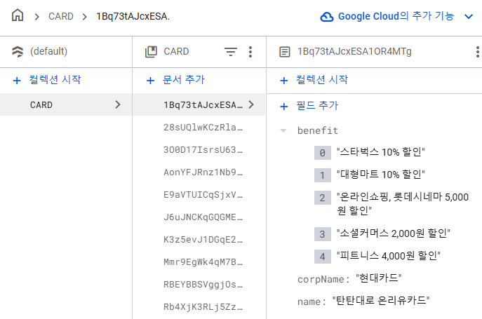
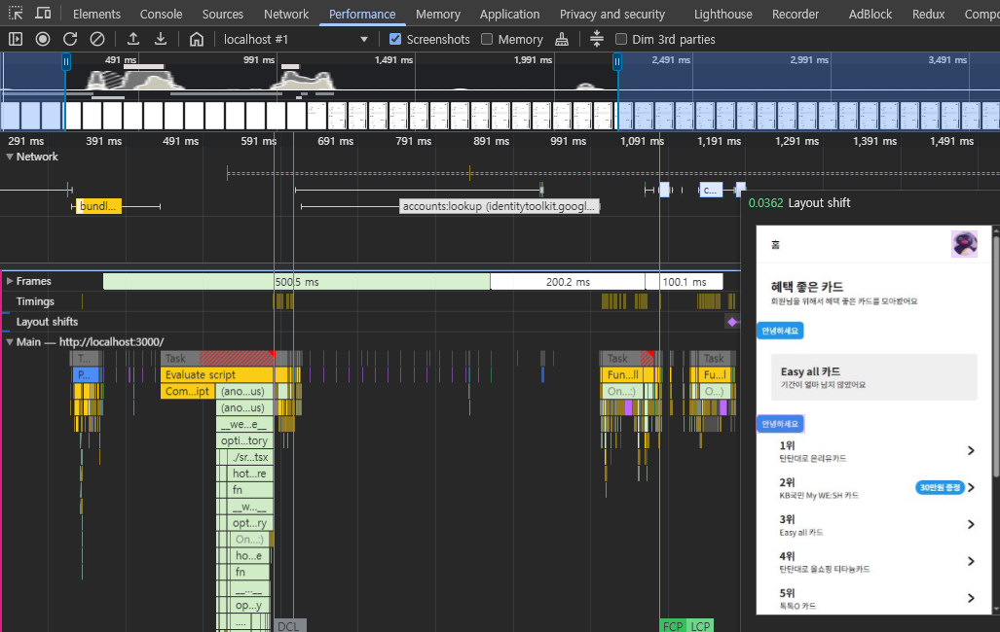

# React 최적화 Part2 - 카드사 서비스

## Firebase 설정

<details>
  <summary>열기</summary>

  ### Firebase

  - 모바일과 웹 애플리케이션 개발을 위한 백엔드 서비스와 도구를 제공해주는 클라우드 기반 플랫폼

  ### Firebase Auth

  - 여러 인증 방법을 제공
  - 복잡한 인증 시스템을 처음부터 구축할 필요 X
  - Firestore, Storage 같은 다른 firebase 서비스와의 통합에 용이

  ### Firebase Store

  - NoSQL 클라우드 데이터베이스
  - 배열, 맵, 중첩된 객체 등 다양한 데이터 타입을 저장 및 관리 할 수 있음
  - 데이터 변경 사항을 실시간으로 동기화하여, 사용자들에게 데이터 업데이트를 즉시 보여줄 수 있음
  - 보안 규칙을 설정하여 특정 조건 아래에서만 데이터 액세스 할 수 있도록 함

  ### Firebase 설정

  - [Firebase 사이트](https://console.firebase.google.com/)
  1. 새 프로젝트 생성
  2. 웹 앱에 Firebase 추가
      - firebase 설치
          
          ```bash
          yarn add firebase
          ```
          
      - firebase Configure
          - Cloud Firestore에서 데이터베이스 생성
              - 테스트 모드, 위치: 서울
          - firebase.ts 파일 생성하여 firebase console에서 제공하는 SDK 코드 넣고 key값은 .env 파일로 따로 관리
          
          ```tsx
          import { initializeApp } from 'firebase/app';
          import { getAuth } from 'firebase/auth';
          import { getFirestore } from 'firebase/firestore';
          
          const {
            REACT_APP_API_KEY,
            REACT_APP_AUTH_DOMAIN,
            REACT_APP_PROJECT_ID,
            REACT_APP_STORAGE_BUCKET,
            REACT_APP_MESSAGING_SENDER_ID,
            REACT_APP_APP_ID,
            REACT_APP_MEASUREMENT_ID,
          } = process.env;
          
          const firebaseConfig = {
            apiKey: REACT_APP_API_KEY,
            authDomain: REACT_APP_AUTH_DOMAIN,
            projectId: REACT_APP_PROJECT_ID,
            storageBucket: REACT_APP_STORAGE_BUCKET,
            messagingSenderId: REACT_APP_MESSAGING_SENDER_ID,
            appId: REACT_APP_APP_ID,
            measurementId: REACT_APP_MEASUREMENT_ID,
          };
          
          export const app = initializeApp(firebaseConfig);
          export const auth = getAuth(app);
          export const store = getFirestore(app);
          
          ```
        
</details>

## Emotion 설정

<details>
<summary>열기</summary>

  ### CSS in JS

  - Javascript 파일 내에 CSS를 작성하는 방식
  - 장점
      - 컴포넌트 범위의 스타일을 제공하여 충돌 방지
      - 동적 스타일링
          - 자바스크립트 변수와 함께 사용하여 스타일을 동적으로 쉽게 변경 가능
      - 코드 분할
          - 사용되는 스타일만 번들에 포함
  - 단점
      - 러닝 커브
      - SSR 적용 시 추가적인 설정 필요

  ### Emotion

  - [참고](https://emotion.sh/docs/introduction)
  - 설치
      
      ```bash
      yarn add @emotion/react @emotion/styled
      yarn add -D @emotion/babel-plugin @babel/preset-react
      ```
      
  - `craco.config.cjs` 설정
      
      ```jsx
      const cracoAlias = require('craco-alias');
      
      module.exports = {
        plugins: [
          {
            plugin: cracoAlias,
            options: {
              source: 'tsconfig',
              tsConfigPath: 'tsconfig.paths.json',
            },
          },
        ],
        babel: {
          presets: [
            [
              '@babel/preset-react',
              { runtime: 'automatic', importSource: '@emotion/react' },
            ],
          ],
          plugins: ['@emotion/babel-plugin'],
        },
      };
      
      ```
      
  - `tsconfig.json` 설정
      
      ```json
      {
        "extends": "./tsconfig.paths.json",
        "compilerOptions": {
          "target": "es5",
          "lib": ["dom", "dom.iterable", "esnext"],
          "types": ["@testing-library/jest-dom"],
          "allowJs": true,
          "skipLibCheck": true,
          "esModuleInterop": true,
          "allowSyntheticDefaultImports": true,
          "strict": true,
          "forceConsistentCasingInFileNames": true,
          "noFallthroughCasesInSwitch": true,
          "module": "esnext",
          "moduleResolution": "node",
          "resolveJsonModule": true,
          "isolatedModules": true,
          "noEmit": true,
          "jsx": "react-jsx",
          **"jsxImportSource": "@emotion/react"**
        },
        "include": ["src", "tsconfig.paths.json"]
      }
      ```
      
  - **Unknown property 'css’** eslint 에러 추가 설정
      - `eslint.confg.mjs` 추가 설정
          
          ```jsx
          // eslint.config.mjs (ES Module 형식)
          import eslint from '@eslint/js';
          import eslintPluginReact from 'eslint-plugin-react';
          import eslintPluginReactHooks from 'eslint-plugin-react-hooks';
          import eslintPluginPrettier from 'eslint-plugin-prettier';
          import eslintConfigPrettier from 'eslint-config-prettier';
          import typescriptEslintPlugin from '@typescript-eslint/eslint-plugin';
          import typescriptEslintParser from '@typescript-eslint/parser';
          import globals from 'globals';
          
          export default [
            { ignores: ['dist'] },
            {
              files: ['**/*.{js,jsx,ts,tsx}'],
              plugins: {
                '@typescript-eslint': typescriptEslintPlugin,
                react: eslintPluginReact,
                'react-hooks': eslintPluginReactHooks,
                prettier: eslintPluginPrettier,
              },
              languageOptions: {
                parser: typescriptEslintParser,
                ecmaVersion: 2020, // 또는 최신 ECMAScript 버전
                sourceType: 'module',
                globals: {
                  ...globals.browser,
                  ...globals.node,
                  ...globals.es5,
                  ...globals.jest,
                },
              },
              linterOptions: {
                reportUnusedDisableDirectives: true,
              },
              rules: {
                ...eslint.configs.recommended.rules,
                ...eslintPluginReact.configs.recommended.rules,
                ...eslintPluginReactHooks.configs.recommended.rules,
                ...eslintConfigPrettier.rules,
                **'react/no-unknown-property': ['error', { ignore: ['css'] }],**
                'prettier/prettier': [
                  'error',
                  {
                    endOfLine: 'auto',
                  },
                ],
              },
              settings: {
                react: {
                  version: 'detect',
                },
              },
            },
          ];
          
          ```
          
  - 사용 예시
      
      ```tsx
      import React from 'react';
      import { css } from '@emotion/react';
      import styled from '@emotion/styled';
      
      const bold = css`
        font-weight: bold;
      `;
      
      const containerStyles = css`
        background-color: pink;
        ${bold};
      `;
      
      const Button = styled.button`
        width: 200px;
        height: 100px;
        ${bold};
      `;
      
      function App() {
        return (
          <div className="App" css={containerStyles}>
            <Button>스타일 버튼</Button>
          </div>
        );
      }
      
      export default App;
      ```
</details>

## 스타일 설정 예시(emotion)

<details>
<summary>열기</summary>

  ### 컬러 팔레트 설정

  ```tsx
  import { css } from '@emotion/react';

  export const colorPalette = css`
    :root {
      --red: #f44336;
      --blue: #2196f3;
      --green: #4caf50;
      --white: #fff;
      --black: #212121;
      --grey: #9e9e9e;
    }
  `;

  export const colors = {
    red: 'var(--red)',
    blue: 'var(--blue)',
    green: 'var(--green)',
    white: 'var(--white)',
    black: 'var(--black)',
    grey: 'var(--grey)',
  };

  export type Colors = keyof typeof colors;
  ```

  ### Typography 설정

  ```tsx
  import { css } from '@emotion/react';

  export const typographyMap = {
    t1: css`
      font-size: 30px;
      line-height: 1.35;
    `,
    t2: css`
      font-size: 26px;
      line-height: 1.34;
    `,
    t3: css`
      font-size: 22px;
      line-height: 1.4;
    `,
    t4: css`
      font-size: 20px;
      line-height: 1.45;
    `,
    t5: css`
      font-size: 17px;
      line-height: 1.5;
    `,
    t6: css`
      font-size: 15px;
      line-height: 1.5;
    `,
    t7: css`
      font-size: 13px;
      line-height: 1.5;
    `,
  };

  export type Typography = keyof typeof typographyMap;
  ```

  ### 적용 예시(Text 컴포넌트)

  ```tsx
  import { colors, Colors } from '@styles/colorPalette';
  import { Typography, typographyMap } from '@styles/typography';
  import { CSSProperties } from 'react';

  import styled from '@emotion/styled';

  interface TextProps {
    typography?: Typography;
    color?: Colors;
    display?: CSSProperties['display'];
    textAlign?: CSSProperties['textAlign'];
    fontWeight?: CSSProperties['fontWeight'];
    bold?: boolean;
  }

  const Text = styled.span<TextProps>(
    ({ color = 'black', display, textAlign, fontWeight, bold }) => ({
      color: colors[color],
      display,
      textAlign,
      fontWeight: bold ? 'bold' : fontWeight,
    }),
    ({ typography = 't5' }) => typographyMap[typography],
  );

  export default Text;

  ```

  ### css 자동 완성

  - 백틱(`) 사용하면 vscode에서 자동 완성이 안 됨
  - 객체 문법 사용해서 자동 완성 가능하게 만들 수 있음

</details>

## mock 데이터 firestore에 저장

<details>
<summary>열기</summary>

  - CARD라는 컬렉션에 card_list를 순회하면서 카드 데이터를 저장
      - 한꺼번에 처리하기 위해 writeBatch 사용
  - batch.set으로는 저장되는 것이 아니고 commit을 해야 실제 firestore에 저장됨
      - commit은 비동기 함수이므로 async/await 사용

  ```tsx
  import Button from '@shared/Button';
  import { card_list } from '@/mock/data';
  import { store } from '@remote/firebase';
  import { collection, doc, writeBatch } from 'firebase/firestore';
  import { COLLECTIONS } from '@constants';

  function CardListAddButton() {
    const handleButtonClick = async () => {
      const batch = writeBatch(store);

      card_list.forEach((card) => {
        const docRef = doc(collection(store, COLLECTIONS.CARD));
        batch.set(docRef, card);
      });

      await batch.commit();

      alert('카드 리스트 추가 완료!');
    };

    return <Button onClick={handleButtonClick}>카드 리스트 추가하기</Button>;
  }

  export default CardListAddButton;
  ```

  <div align="center">
    
  </div>

</details>

## firestore 데이터 불러오기

<details>
<summary>열기</summary>

  - getDocs 함수 사용하여 원하는 컬렉션의 데이터들을 불러올 수 있음
      - 비동기 함수이므로 async/await 사용

  ```tsx
  import { collection, getDocs } from 'firebase/firestore';
  import { store } from './firebase';
  import { COLLECTIONS } from '@constants';
  import { Card } from '@models/card';

  export async function getCards() {
    const cardSnapshot = await getDocs(collection(store, COLLECTIONS.CARD));

    return cardSnapshot.docs.map((doc) => ({
      id: doc.id,
      ...(doc.data() as Card),
    }));
  }
  ```

  ## 컴포넌트 합성

  - 부모 컴포넌트에서 props으로 넘겨주면 너무 복잡해 질 수 있으니 컴포넌트 합성을 통해 해결
      - UI와 로직을 분리하는데 도움이 되며 컴포넌트 간의 의존성을 줄이고 독립성을 강화할 수 있음
  - 코드의 가독성과 재사용성이 높아짐

  ```tsx

  import React from 'react';
  import Flex from './Flex';
  import { css } from '@emotion/react';
  import Text from './Text';

  interface ListRowProps {
    left?: React.ReactNode;
    contents: React.ReactNode;
    right?: React.ReactNode;
    withArrow?: boolean;
    onClick?: () => void;
  }

  function ListRow({ left, contents, right, withArrow, onClick }: ListRowProps) {
    return (
      <Flex as="li" css={listRowContainerStyles} onClick={onClick}>
        <Flex css={listRowLeftStyles}>{left}</Flex>
        <Flex css={listRowContentsStyles}>{contents}</Flex>
        <Flex>{right}</Flex>
        {withArrow ? <IconArrowRight /> : null}
      </Flex>
    );
  }

  const listRowContainerStyles = css`
    padding: 8px 24px;
  `;

  const listRowLeftStyles = css`
    margin-right: 14px;
  `;

  const listRowContentsStyles = css`
    flex: 1;
  `;

  **function ListRowTexts({
    title,
    subTitle,
  }: {
    title: string;
    subTitle: string;
  }) {
    return (
      <Flex direction="column">
        <Text bold={true}>{title}</Text>
        <Text typography="t7">{subTitle}</Text>
      </Flex>
    );
  }**

  function IconArrowRight() {
    return (
      <svg
        viewBox="0 0 96 96"
        xmlns="http://www.w3.org/2000/svg"
        width={20}
        height={20}
      >
        <title />
        <path d="M69.8437,43.3876,33.8422,13.3863a6.0035,6.0035,0,0,0-7.6878,9.223l30.47,25.39-30.47,25.39a6.0035,6.0035,0,0,0,7.6878,9.2231L69.8437,52.6106a6.0091,6.0091,0,0,0,0-9.223Z" />
      </svg>
    );
  }

  **ListRow.Texts = ListRowTexts;**

  export default ListRow;
  ```

  ```tsx
  import ListRow from '@shared/ListRow';

  function CardList() {
    return (
      <div>
        <ul>
          <ListRow
            left={<div>left</div>}
            contents={**<ListRow.Texts title="타이틀" subTitle="서브타이틀" />**}
            right={<div>right</div>}
            withArrow={true}
          />
        </ul>
      </div>
    );
  }

  export default CardList;
  ```

</details>

## `useInfiniteQuery`를 사용한 페이지네이션

<details>
<summary>열기</summary>

  - 각 페이지의 마지막 요소에 cursor를 줘서 무한 스크롤 기능을 구현
      - pageParam이 지금 보이고 있는 맨 마지막 요소
      
      ```tsx
      import {
        collection,
        getDocs,
        QuerySnapshot,
        query,
        limit,
        startAfter,
      } from 'firebase/firestore';
      import { store } from './firebase';
      import { COLLECTIONS } from '@constants';
      import { Card } from '@models/card';
      
      // pageParam => 지금 보이고 있는 맨 마지막 요소
      export async function getCards(pageParam?: QuerySnapshot<Card>) {
        const cardQuery =
          pageParam == null
            ? query(collection(store, COLLECTIONS.CARD), limit(10))
            : query(
                collection(store, COLLECTIONS.CARD),
                startAfter(pageParam),
                limit(10),
              );
      
        const cardSnapshot = await getDocs(cardQuery);
      
        const lastVisible = cardSnapshot.docs[cardSnapshot.docs.length - 1];
      
        const items = cardSnapshot.docs.map((doc) => ({
          id: doc.id,
          ...(doc.data() as Card),
        }));
      
        return { items, lastVisible };
      }
      ```
      
  - `useQuery` 대신 `useInfiniteQuery`를 사용해 data와 lastVisible을 받아옴
      - 받아온 data는 useQuery와 달리 이중 배열을 형태로 반환되기 때문에 flatten 시키기 위해 `lodash` 라이브러리 사용
          
          ```bash
          yarn add loadash
          ```
          
      - 무한 스크롤 기능을 쉽게 구현하기 위해 `react-infinite-scroll-component` 라이브러리 사용
          - scrollThreshold 값을 통해 데이터 fetch 트리거 지점을 조정할 수 있음
          
          ```bash
          yarn add react-infinite-scroll-component
          ```
          
          ```tsx
          import { useInfiniteQuery } from 'react-query';
          import { getCards } from '@remote/card';
          import { flatten } from 'lodash';
          import InfiniteScroll from 'react-infinite-scroll-component';
          import ListRow from '@shared/ListRow';
          import { useCallback } from 'react';
          import Badge from '@shared/Badge';
          
          function CardList() {
            const {
              data,
              hasNextPage = false,
              fetchNextPage,
              isFetching,
            } = useInfiniteQuery(['cards'], ({ pageParam }) => getCards(pageParam), {
              getNextPageParam: (snapshot) => snapshot.lastVisible,
            });
          
            // 패치 중이거나 다음 페이지가 없으면 아무것도 하지 않음
            const loadMore = useCallback(() => {
              if (hasNextPage === false || isFetching) {
                return;
              }
          
              fetchNextPage();
            }, [fetchNextPage, hasNextPage, isFetching]);
          
            if (data == null) {
              return null;
            }
          
            const cards = flatten(data?.pages.map(({ items }) => items));
          
            return (
              <div>
                <InfiniteScroll
                  dataLength={cards.length}
                  hasMore={hasNextPage}
                  loader={<></>}
                  next={loadMore}
                  scrollThreshold="100px"
                >
                  <ul>
                    {cards.map((card, idx) => {
                      return (
                        <ListRow
                          key={card.id}
                          contents={
                            <ListRow.Texts title={`${idx + 1}위`} subTitle={card.name} />
                          }
                          right={
                            card.payback != null ? <Badge label={card.payback} /> : null
                          }
                          withArrow={true}
                        />
                      );
                    })}
                  </ul>
                </InfiniteScroll>
              </div>
            );
          }
          
          export default CardList;
          ```
</details>

## 애니메이션 구현(keyframes, framer-motion)

<details>
<summary>열기</summary>

  ### keyframes 사용

  - styled 같이 keyframes를 정의하여 animation css 속성에 넣어서 사용
      - 시간, 표현 방법 등을 선택할 수 있음
      - animation을 반복하지 않으려면 forwards를 써야 함
      
      ```tsx
      import styled from '@emotion/styled';
      import { css, keyframes } from '@emotion/react';
      
      const slideup = keyframes`
        to {
          transform: translateY(0);
        }
      `;
      
      const Container = styled.div`
        position: fixed;
        bottom: 0;
        left: 0;
        right: 0;
        background-color: ${colors.white};
        padding: 20px 10px 8px;
        transform: translateY(100%);
        animation: ${slideup} 0.5s ease-in-out forwards;
      `;
      ```
      

  ### framer-motion 라이브러리 사용

  - 애니메이션을 쉽게 제어할 수 있는 라이브러리
  - `motion` 태그에 넣어서 사용
      - `initial`: 초기 스타일
      - `transition`: 애니메이션 길이, 표현 방법, delay 등을 설정
      - `animate`: 애니메이션이 완료된 후의 스타일
      - `whileInView`: viewport 영역 내로 들어오면 다시 애니메이션이 동작
      
      ```tsx
      <ul>
        {benefit.map((text, idx) => {
          return (
            <motion.li
              key={text}
              initial={{ opacity: 0, translateX: -90 }}
              transition={{
                duration: 0.7,
                ease: 'easeInOut',
                delay: idx * 0.1,
              }}
              animate={{ opacity: 1, translateX: 0 }}
            >
              <ListRow
                as="div"
                left={<IconCheck />}
                contents={
                  <ListRow.Texts title={`혜택 ${idx + 1}`} subTitle={text} />
                }
              />
            </motion.li>
          );
        })}
      </ul>
      ```
  
</details>

## 회원 가입 구현

<details>
<summary>열기</summary>

  ### input value 관리

  - controlled 방식 사용
  - `handleFormValues` 함수는 **외부의 값에 의존하고 있지 않기 때문**에 `useCallback` 사용하여 불필요한 리렌더링 방지
  - 코드
      
      ```tsx
      import { css } from '@emotion/react';
      import Flex from '@shared/Flex';
      import TextField from '@shared/TextField';
      import FixedBottomButton from '@shared/FixedBottomButton';
      import Spacing from '@shared/Spacing';
      import { ChangeEvent, useCallback, useState } from 'react';
      import { FormValues } from '@models/signup';
      
      function Form() {
        const [formValues, setFormValues] = useState<FormValues>({
          email: '',
          password: '',
          rePassword: '',
          name: '',
        });
      
        const handleFormValues = useCallback((e: ChangeEvent<HTMLInputElement>) => {
          setFormValues((prev) => ({
            ...prev,
            [e.target.name]: e.target.value,
          }));
        }, []);
      
        return (
          <Flex direction="column" css={formContainerStyles}>
            <TextField
              label="이메일"
              name="email"
              placeholder="olaf@gmail.com"
              value={formValues.email}
              onChange={handleFormValues}
            />
            <Spacing size={16} />
            <TextField
              label="패스워드"
              name="password"
              type="password"
              value={formValues.password}
              onChange={handleFormValues}
            />
            <Spacing size={16} />
            <TextField
              label="패스워드 재확인"
              name="rePassword"
              type="password"
              value={formValues.rePassword}
              onChange={handleFormValues}
            />
            <Spacing size={16} />
            <TextField
              label="이름"
              name="name"
              placeholder="올라프"
              value={formValues.name}
              onChange={handleFormValues}
            />
            <FixedBottomButton label="회원가입" disabled={true} onClick={() => {}} />
          </Flex>
        );
      }
      
      const formContainerStyles = css`
        padding: 24px;
      `;
      
      export default Form;
      ```
      

  ### 유효성 체크

  - validator 라이브러리 사용하여 간편하게 구현 가능
  - `onBlur` 이벤트 사용하여 초기 상태에서는 에러 메시지 안 뜨게 구현 가능
  - 코드
      
      ```tsx
      import { ChangeEvent, useCallback, useMemo, useState } from 'react';
      import { css } from '@emotion/react';
      import validator from 'validator';
      import Flex from '@shared/Flex';
      import TextField from '@shared/TextField';
      import FixedBottomButton from '@shared/FixedBottomButton';
      import Spacing from '@shared/Spacing';
      import { FormValues } from '@models/signup';
      
      function Form() {
        const [formValues, setFormValues] = useState<FormValues>({
          email: '',
          password: '',
          rePassword: '',
          name: '',
        });
      
        const [dirty, setDirty] = useState<Partial<FormValues>>({});
      
        const handleFormValues = useCallback((e: ChangeEvent<HTMLInputElement>) => {
          setFormValues((prev) => ({
            ...prev,
            [e.target.name]: e.target.value,
          }));
        }, []);
      
        const handleBlur = useCallback((e: ChangeEvent<HTMLInputElement>) => {
          setDirty((prev) => ({
            ...prev,
            [e.target.name]: 'true',
          }));
        }, []);
      
        const errors = useMemo(() => validate(formValues), [formValues]);
      
        const isValid = Object.keys(errors).length === 0;
      
        return (
          <Flex direction="column" css={formContainerStyles}>
            <TextField
              label="이메일"
              name="email"
              placeholder="olaf@gmail.com"
              value={formValues.email}
              onChange={handleFormValues}
              hasError={Boolean(dirty.email) && Boolean(errors.email)}
              helpMessage={dirty.email ? errors.email : ''}
              onBlur={handleBlur}
            />
            <Spacing size={16} />
            <TextField
              label="패스워드"
              name="password"
              type="password"
              value={formValues.password}
              onChange={handleFormValues}
              hasError={Boolean(dirty.password) && Boolean(errors.password)}
              helpMessage={dirty.password ? errors.password : ''}
              onBlur={handleBlur}
            />
            <Spacing size={16} />
            <TextField
              label="패스워드 재확인"
              name="rePassword"
              type="password"
              value={formValues.rePassword}
              onChange={handleFormValues}
              hasError={Boolean(dirty.rePassword) && Boolean(errors.rePassword)}
              helpMessage={dirty.rePassword ? errors.rePassword : ''}
              onBlur={handleBlur}
            />
            <Spacing size={16} />
            <TextField
              label="이름"
              name="name"
              placeholder="올라프"
              value={formValues.name}
              onChange={handleFormValues}
              hasError={Boolean(dirty.name) && Boolean(errors.name)}
              helpMessage={dirty.name ? errors.name : ''}
              onBlur={handleBlur}
            />
            <FixedBottomButton
              label="회원가입"
              disabled={!isValid}
              onClick={() => {}}
            />
          </Flex>
        );
      }
      
      const formContainerStyles = css`
        padding: 24px;
      `;
      
      function validate(formValues: FormValues) {
        let errors: Partial<FormValues> = {};
      
        if (validator.isEmail(formValues.email) === false) {
          errors.email = '이메일 형식을 확인해주세요';
        }
      
        if (formValues.password.length < 8) {
          errors.password = '비밀번호를 8글자 이상 입력해주세요';
        }
      
        if (formValues.rePassword.length < 8) {
          errors.rePassword = '비밀번호를 8글자 이상 입력해주세요';
        } else if (
          validator.equals(formValues.password, formValues.rePassword) === false
        ) {
          errors.rePassword = '비밀번호를 확인해주세요';
        }
      
        if (formValues.name.length < 2) {
          errors.name = '이름은 2글자 이상 입력해주세요';
        }
      
        return errors;
      }
      
      export default Form;
      
      ```
      

  ### Fire Auth 로그인 API 구현

  - firebase console에서 빌드 - Authentication - 이메일/비밀번호 사용 설정 활성화
  - `createUserWithEmailAndPassword` 사용하여 fire auth 사용하여 회원가입
  - DB에 회원 정보를 저장하기 위해 이름 위의 과정에서 반환된 user 데이터 정보(uid, email)와 사용자 입력값(이름)을 firestore에 저장

  ```tsx
  import { createUserWithEmailAndPassword, updateProfile } from 'firebase/auth';
  import { collection, doc, setDoc } from 'firebase/firestore';
  import Form from '@components/signup/Form';
  import { FormValues } from '@models/signup';

  import { auth, store } from '@remote/firebase';
  import { COLLECTIONS } from '@constants';

  function SignupPage() {
    const handleSubmit = async (formValues: FormValues) => {
      const { email, password, name } = formValues;
      const { user } = await createUserWithEmailAndPassword(
        auth,
        email,
        password,
      );
      await updateProfile(user, {
        displayName: name,
      });

      const newUser = {
        uid: user.uid,
        email: user.email,
        displayName: name,
      };

      await setDoc(doc(collection(store, COLLECTIONS.USER), user.uid), newUser);
    };

    return (
      <div>
        <Form onSubmit={handleSubmit} />
      </div>
    );
  }

  export default SignupPage;

  ```

</details>

## 전역 상태 관리

<details>
<summary>열기</summary>

  ### 전역 상태 관리가 필요한 경우

  - 여러 페이지를 거쳐서 공통적으로 어떠한 값을 다뤄야 할 때 필요
      - 유저 정보
      - 신청 폼 값(여러 페이지에 걸친 정보)
  - 유저 정보를 props으로 내려서 사용할 수도 있지만 depth가 너무 깊음

  ### Context API

  - Reaact에서 기본으로 지원
  - 사용이 간단
  - 성능 최적화는 직접 관리해야 함
      - state가 바뀌면 리렌더링이 일어나기 때문에 성능 최적화 따로 필요

  ### Recoil (React 19에서는 지원 X)

  - 단순
      - 코드의 복잡도 낮출 수 있음
  - 비동기 상태 업데이트를 쉽게 처리
      - Selector 사용 시, 캐싱도 지원
  - 변경된 상태값에 관련된 컴포넌트만 업데이트
  - 최상위 루트에서 RecoilRoot로 감싸줘야 사용 가능
      
      ```tsx
      import React from 'react';
      import ReactDOM from 'react-dom/client';
      import App from './App';
      import { RecoilRoot } from 'recoil';
      
      const root = ReactDOM.createRoot(
        document.getElementById('root') as HTMLElement,
      );
      
      root.render(
        <React.StrictMode>
          <RecoilRoot>
            ...
            <App />
            ...
          </RecoilRoot>
        </React.StrictMode>,
      );
      ```
      

  ### Auth Guard 설정

  - 로그인 여부에 따라서 전역 상태값을 변경하는 컴포넌트
  - firebase auth의 `onAuthStateChanged` 를 사용
      - firebase의 인증 상태가 바뀌면 동작하는 함수
  - 로그인 인증이 완료되면 recoil의 useAtom 상태를 변경

  ```tsx
  import React, { useState } from 'react';
  import { useSetRecoilState } from 'recoil';
  import { onAuthStateChanged } from 'firebase/auth';
  import { auth } from '@remote/firebase';
  import { userAtom } from '@atoms/user';

  // 인증 처리
  function AuthGuard({ children }: { children: React.ReactNode }) {
    const [initialize, setInitialize] = useState(false);
    const setUser = useSetRecoilState(userAtom);

    onAuthStateChanged(auth, (user) => {
      if (user != null) {
        setUser({
          uid: user.uid,
          email: user.email ?? '',
          displayName: user.displayName ?? '',
        });
      } else {
        setUser(null);
      }

      setInitialize(true);
    });

    if (initialize === false) {
      return null;
    }

    return <>{children}</>;
  }

  export default AuthGuard;
  ```

</details>

## 로그인 구현

<details>
<summary>열기</summary>

  ### 로그인

  - firebase auth의 `signInWithEmailAndPassword` 사용하여 로그인 기능 구현
      
      ```tsx
      import Form from '@components/signin/Form';
      import { useCallback } from 'react';
      import { useNavigate } from 'react-router-dom';
      import { FormValues } from '@models/signin';
      import { signInWithEmailAndPassword } from 'firebase/auth';
      import { auth } from '@remote/firebase';
      import { useAlertContext } from '@contexts/AlertContext';
      import { FirebaseError } from 'firebase/app';
      
      function SigninPage() {
        const { open } = useAlertContext();
        const navigate = useNavigate();
      
        const handleSubmit = useCallback(
          async (formValues: FormValues) => {
            const { email, password } = formValues;
      
            try {
              await signInWithEmailAndPassword(auth, email, password);
              navigate('/');
            } catch (e) {
              // firebase 에러
              if (e instanceof FirebaseError) {
                if (e.code === 'auth/invalid-credential') {
                  open({
                    title: '계정의 정보를 다시 확인해주세요',
                    onButtonClick: () => {},
                  });
                  return;
                }
              }
              // 일반적인 에러
              open({
                title: '잠시 후 다시 시도해주세요.',
                onButtonClick: () => {},
              });
            }
          },
          [open],
        );
      
        return (
          <div>
            <Form onSubmit={handleSubmit} />
          </div>
        );
      }
      
      export default SigninPage;
      ```
      
  - 강의에서는 FirebaseError 분기 처리를 auth/wrong-password 코드로 진행했지만, 2023.09.15 이후로는 자동으로 이메일 열거 보호가 설정되어있어서 어떠한 이유 때문에 로그인 에러가 났는지 알 수 없고 auth/invalid-credential 코드가 반환

  ### 로그인 페이지로 강제 이동 후, 로직 처리

  - 회원만 사용할 수 있는 서비스에 접근할 때, 로그인 페이지로 강제 이동
      - 강제 이동 후 로그인을 했을 때, 사용하려던 서비스 페이지로 가야 UX 적으로 효과적
  - navigate의 state prop을 사용하여 처리 가능
      - 강제 이동할 때, navigate의 state에 접근하려던 서비스의 path를 넣어서 이동
      
      ```tsx
      const moveToApply = useCallback(() => {
          if (user == null) {
            open({
              title: '로그인이 필요한 기능입니다.',
              onButtonClick: () => {
                navigate('/signin', { **state: { from: `/apply/${id}` }** });
              },
            });
      
            return;
          }
      
          navigate(`/apply/${id}`);
        }, [user, id, open, navigate]);
      ```
      
  - 로그인 페이지에서는 로그인 처리 후, useLocation 사용하여 state에 들어있는 from 값을 읽어와 강제 이동 된 경우, 원래의 path로 이동
      
      ```tsx
      import Form from '@components/signin/Form';
      import { useCallback } from 'react';
      import { useLocation, useNavigate } from 'react-router-dom';
      import { FormValues } from '@models/signin';
      import { signInWithEmailAndPassword } from 'firebase/auth';
      import { auth } from '@remote/firebase';
      import { useAlertContext } from '@contexts/AlertContext';
      import { FirebaseError } from 'firebase/app';
      
      function SigninPage() {
        const { open } = useAlertContext();
        const navigate = useNavigate();
        const location = useLocation();
        const from = location.state?.from || '/';
      
        const handleSubmit = useCallback(
          async (formValues: FormValues) => {
            const { email, password } = formValues;
      
            try {
              await signInWithEmailAndPassword(auth, email, password);
              navigate(from, { replace: true });
            } catch (e) {
              // firebase 에러
              if (e instanceof FirebaseError) {
                if (e.code === 'auth/invalid-credential') {
                  open({
                    title: '계정의 정보를 다시 확인해주세요',
                    onButtonClick: () => {},
                  });
                  return;
                }
              }
              // 일반적인 에러
              open({
                title: '잠시 후 다시 시도해주세요.',
                onButtonClick: () => {},
              });
            }
          },
          [open],
        );
      
        return (
          <div>
            <Form onSubmit={handleSubmit} />
          </div>
        );
      }
      
      export default SigninPage;
      ```
</details>

## 카드 신청

<details>
<summary>열기</summary>

  ### Polling 방식으로 완료 여부 받아오기

  - useQuery의 refetchInterval 사용하여 2초마다 신청 상태를 가져오도록 커스텀 hook 구현(usePollApplyStatus)
      - 현재 구현 로직은 상태값 4가지 중 랜덤으로 반환하게 되어있음
      - 반환된 값이 COMPLETE일 때, onSuccess, 아닐 때 onError 함수 반환
  - usePollApplyStatus에서 카드 신청 결과를 DB에 해당 신청 정보 저장 후, 결과 페이지로 이동

  ```tsx
  import { useQuery } from 'react-query';
  import { APPLY_STATUS } from '@models/apply';

  interface usePollApplyStatusProps {
    onSuccess: () => void;
    onError: () => void;
    enabled: boolean;
  }

  function usePollApplyStatus({
    enabled,
    onSuccess,
    onError,
  }: usePollApplyStatusProps) {
    return useQuery(['applyStatus'], () => getApplyStatus(), {
      enabled,
      refetchInterval: 2_000,
      staleTime: 0,
      onSuccess: (status) => {
        if (status === APPLY_STATUS.COMPLETE) {
          onSuccess();
        }
      },
      onError: () => {
        onError();
      },
    });
  }

  function getApplyStatus() {
    const values = [
      APPLY_STATUS.READY,
      APPLY_STATUS.PROGRESS,
      APPLY_STATUS.COMPLETE,
      APPLY_STATUS.REJECT,
    ];

    const status = values[Math.floor(Math.random() * values.length)];

    if (status === APPLY_STATUS.REJECT) {
      throw new Error('카드 발급에 실패했습니다.');
    }

    return status;
  }

  export default usePollApplyStatus;
  ```

  ```tsx
  import Apply from '@components/apply';
  import useApplyCardMutation from '@components/apply/hooks/useApplyCardMutation';
  import { useState } from 'react';
  import usePollApplyStatus from '@components/apply/hooks/usePollApplyStatus';
  import { updateApplyCard } from '@remote/apply';
  import { APPLY_STATUS } from '@models/apply';
  import useUser from '@hooks/auth/useUser';
  import useAppliedCard from '@components/apply/hooks/useAppliedCard';
  import { useNavigate, useParams } from 'react-router-dom';
  import { useAlertContext } from '@contexts/AlertContext';
  import FullPageLoader from '@/components/shared/FullPageLoader';

  function ApplyPage() {
    const navigate = useNavigate();
    const { open } = useAlertContext();

    const [readyToPoll, setReadyToPoll] = useState(false);

    const user = useUser();
    const { id } = useParams() as { id: string };

    const { data } = useAppliedCard({
      userId: user?.uid as string,
      cardId: id,
      options: {
        onSuccess: (applied) => {
          if (applied == null) {
            return;
          }

          if (applied.status === APPLY_STATUS.COMPLETE) {
            open({
              title: '이미 발급이 완료된 카드입니다',
              onButtonClick: () => {
                window.history.back();
              },
            });

            return;
          }

          setReadyToPoll(true);
        },
        onError: () => {},
        suspense: true,
      },
    });

    usePollApplyStatus({
      onSuccess: async () => {
        await updateApplyCard({
          userId: user?.uid as string,
          cardId: id,
          applyValues: {
            status: APPLY_STATUS.COMPLETE,
          },
        });
        navigate('/apply/done?success=true', { replace: true });
      },
      onError: async () => {
        await updateApplyCard({
          userId: user?.uid as string,
          cardId: id,
          applyValues: {
            status: APPLY_STATUS.REJECT,
          },
        });
        navigate('/apply/done?success=false', { replace: true });
      },
      enabled: readyToPoll,
    });

    const { mutate, isLoading: isProgressing } = useApplyCardMutation({
      onSuccess: () => {
        setReadyToPoll(true);
      },
      onError: () => {
        window.history.back();
      },
    });

    if (data != null && data.status === APPLY_STATUS.COMPLETE) {
      return null;
    }

    if (readyToPoll || isProgressing) {
      return <FullPageLoader message="카드를 신청중입니다" />;
    }

    return <Apply onSubmit={mutate} />;
  }

  export default ApplyPage;
  ```

</details>

## 마이페이지(storage ⇒ cloudinary)

<details>
<summary>열기</summary>

  <blockquote>
    <strong>💡 Tip</strong><br>
    &nbsp;- 현 프로젝트에서는 마이페이지에서 로그아웃과 프로필 사진 변경을 할 수 있도록 함<br>
    &nbsp;- 강의에서는 Firebase의 Storage를 사용해서 구현했으나 유료화 되어 Cloudinary API를 사용하여 구현<br>
    &nbsp;&nbsp;&nbsp;&nbsp;- 무료 사용 가능하나 저장될 path 설정은 불가능한듯(?)
  </blockquote>

  ### Cloudinary API 사용법

  - cloudinary document 참고하여 upload 함수 구현
      - 반환 값에서 url을 추출하여 저장

  ```tsx
  export async function uploadProfileImage(file: File) {
    const data = new FormData();
    data.append('file', file);
    data.append('upload_preset', process.env.REACT_APP_PRESET_ID as string);
    const cloudName = process.env.REACT_APP_CLOUD_ID;
    const res = await fetch(
      `https://api.cloudinary.com/v1_1/${cloudName}/upload`,
      {
        method: 'POST',
        body: data,
      },
    );

    return res.json();
  }
  ```

  - cloudinary API를 사용하여 받은 image url을 store와 auth에 업데이트
      - 업데이트 후, recoil 상태 값도 변경

  ```tsx
  const handleUploadImage = async (e: ChangeEvent<HTMLInputElement>) => {
    const files = e.target.files;

    const currentUser = getAuth(app).currentUser;

    if (files == null || user == null || currentUser == null) {
      return;
    }

    const uploaded = await uploadProfileImage(files[0]);
    await updateProfile(currentUser, {
      photoURL: uploaded.url,
    });

    await updateDoc(doc(collection(store, COLLECTIONS.USER), currentUser.uid), {
      photoUrl: uploaded.url,
    });

    setUser({
      ...user,
      photoURL: uploaded.url,
    });
  };
  ```

</details>

## 프로젝트 최적화

<details>
<summary>열기</summary>

### Tree Shaking

- 사용하지 않는 불필요한 코드와 변수 등을 제거하여 용량을 줄이는 방법

#### CJS와 ESM

`CJS`

- CJS는 특정 함수 안에서 어떤 조건에 따라서 동적으로 모듈을 가지고 오는 것이 가능
- 어떤 것이 필요하고 필요 없는지 파악하기 어려움

`ESM`

- ESM은 동적으로 모듈을 가지고오거나 내보내는 것이 불가능
- 어떤 것이 필요하고 필요 없는지 파악하기 쉽기 때문에 **트리 쉐이킹에 적합**

|  | Common JS(CJS) | Ecma Script Module(ESM) |
| --- | --- | --- |
| 문법 | require/module.exports | import/export, export default |
| 로딩 방식 | 동적 | 정적 |
| 분석 시점 | 런타임(코드 실행시) | 빌드 |
| 버전 | ES5 | ES6 |

#### Webpack Bundler Analyzer

- webpack-bundle-analyzer를 통해 번들 사이즈를 분석할 수 있음
    
    ```jsx
    const cracoAlias = require('craco-alias');
    const BundleAnalyzerPlugin =
      require('webpack-bundle-analyzer').BundleAnalyzerPlugin;
    
    const isProduction = process.env.NODE_ENV === 'production';
    
    console.log('process.env', process.env);
    
    module.exports = {
      plugins: [
        {
          plugin: cracoAlias,
          options: {
            source: 'tsconfig',
            tsConfigPath: 'tsconfig.paths.json',
          },
        },
      ],
      babel: {
        presets: [
          [
            '@babel/preset-react',
            { runtime: 'automatic', importSource: '@emotion/react' },
          ],
        ],
        plugins: ['@emotion/babel-plugin'],
      },
      webpack: {
        plugins: isProduction ? [] : [new BundleAnalyzerPlugin()],
      },
    };
    ```
    

### Layout Shift

- 레이아웃이 이동하는 현상
- 로딩 시간에 따라 이미지나 텍스트가 늦게 렌더링 되어 UX를 해치는 행위
    - 예) 버튼을 누르려고 하다가 위에 이미지가 생겨서 버튼이 밑으로 내려가버림
- 미리 요소들의 너비나 높이를 가지는 Skeleton UI를 구현하여 Layout Shift 현상이 일어나지 않게 방지할 수 있음
    
    ```tsx
    import styled from '@emotion/styled';
    import { keyframes } from '@emotion/react';
    import { colors } from '@styles/colorPalette';
    
    const opacity = keyframes`
      0% {
        opacity: 1;
      }
    
      50% {
        opacity: 0.4;
      }
    
      100% {
        opacity: 1;
      }
    `;
    
    const Skeleton = styled.div<{ width: number; height: number }>(
      ({ width, height }) => ({
        width,
        height,
        backgroundColor: colors.grey,
        animation: `${opacity} 2s ease-in-out 0.5s infinite`,
      }),
    );
    
    export default Skeleton;
    ```
    
- 개발자 도구의 성능 탭에서 Layout Shift가 어느 시점에 나타나는지 확인할 수 있음
    <div align="center">
      
    </div>

### 병목 코드 제거

- Javascript는 싱글 쓰레드 언어
    - 앞 작업이 오래 걸리면 후속 작업에 대한 처리가 그만큼 늦어짐
- 개발자 도구의 성능 탭에서 어느 요소가 가장 많은 시간을 차지하는지 병목 지점을 알아낼 수 있음
    - `DCL`
        - HTML 파싱이 끝났을 때 일어나는 이벤트
    - `L`
        - 페이지에서 사용되고 있는 모든 리소스가 다 다운로드 받아졌을 때 발생
    - `FP/FCP`
        - 사용자가 처음 화면 요소를 보게 될 때 발생
        - 렌더링 시간 최적화와 관련
    - `LCP`
        - 가장 큰 이미지나 텍스트 묶음이 뷰포트에 등장할 때 발생

### 카드 신청 UX 개선

- 문제점
    - 신청 단계가 어느 정도 있는지 사용자가 알 수 없으면 언제 끝날지 모른 채로 계속 신청 폼을 채워야 함
    - 카드 신청 후 로딩 페이지에서 아무런 변화가 일어나지 않아서 잘 진행되고 있는지 알 수 없어 사용자의 이탈이 일어날 수 있음
- 개선 방법
    - Progress를 알 수 있는 컴포넌트 추가
    - 문구를 계속 바꿔주면 로딩 중임을 확실하게 알 수 있음

### 컴포넌트 우선순위 설정

`Intersection Observer`

- 뷰포트와 원하는 요소의 교차점을 관찰하는 API
- 특정 요소가 사용자의 화면에 노출되었는지를 구별

```tsx
import { useQuery } from 'react-query';
import { useInView } from 'react-intersection-observer';
import Skeleton from '@shared/Skeleton';
import Spacing from '@shared/Spacing';

function Review() {
  **const { ref, inView } = useInView({
    triggerOnce: true,
  });**

  const { data = [], isLoading } = useQuery(
    ['review'],
    () => {
      return new Promise<string[]>((resolve) => {
        setTimeout(() => {
          resolve(['너무 좋아요', '꼭 신청하세요!!']);
        }, 2_000);
      });
    },
    {
      **enabled: inView,**
    },
  );

  return (
    <div ref={ref}>
      {isLoading ? (
        <>
          <Skeleton width={30} height={10} />
          <Spacing size={3} />
          <Skeleton width={30} height={10} />
        </>
      ) : (
        data.map((review) => <div key={review}>{review}</div>)
      )}
    </div>
  );
}

export default Review;
```

</details>

## 참고

<details>
<summary>열기</summary>

### Input 컨트롤 방식(Controlled, Uncontrolled)

`Controlled`

- state 활용
- input 값이 변경되면 state 값이 변경되고 리렌더링 됨
- 유저의 액션에 따라 form에 변화를 줘야 하는 경우 적합

`Uncontrolled`

- ref 사용
- input 값이 변경되어도 리렌더링 되지 않음
- 단순 입력인 상황에 적합

</details>